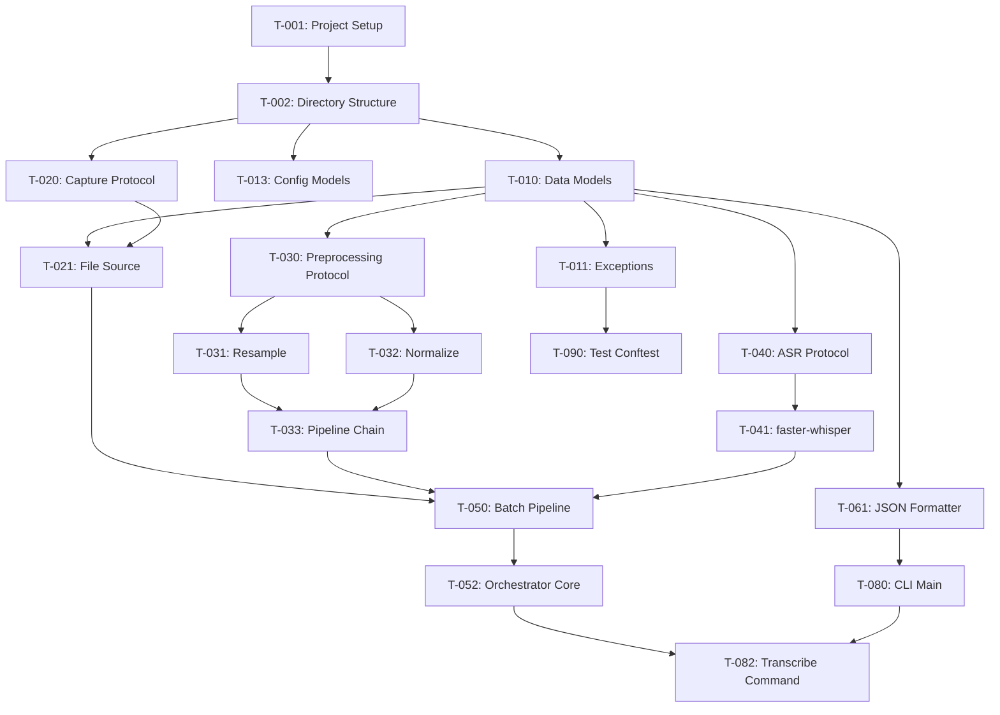

# VoxFusion Engineering Task Breakdown

**Version**: 1.0
**Last Updated**: 2026-02-11
**Project**: VoxFusion v0.1.0 MVP → v1.0.0 Production

---

## Overview

This document provides a complete, actionable task breakdown for implementing VoxFusion from scratch. The project follows a milestone-based roadmap with clear dependencies and parallelization opportunities for a 3-developer team.

### Developer Roles

- **Dev A (Infrastructure Lead)**: Core infrastructure, config system, pipeline orchestration, project scaffolding
- **Dev B (Audio/ASR Specialist)**: Audio capture, pre-processing, ASR engine integration
- **Dev C (Output/Features)**: Output formatters, translation, diarization, CLI commands

### Milestone Timeline

- **v0.1.0 (MVP)**: Batch transcription with basic CLI (~2-3 weeks, 40-50 hours total)
- **v0.2.0**: Real-time streaming (~2-3 weeks)
- **v0.3.0**: Speaker diarization (~2-3 weeks)
- **v0.4.0**: Translation (~1-2 weeks)
- **v0.5.0**: Cross-platform (~2-3 weeks)
- **v1.0.0**: Production ready (~3-4 weeks)

---

## Critical Path for MVP (v0.1.0)

The minimum sequence to reach a working MVP:

```
T-001 → T-002 → T-010 → T-011 → T-020 → T-021 → T-030 → T-050 → T-052 → T-061
```

**Estimated Critical Path Duration**: 12-15 hours of sequential work

---

## Task Index

### Foundation (T-001 to T-009)
- Project scaffolding, directory structure, CI skeleton

### Data Models & Exceptions (T-010 to T-012)
- Shared types, exception hierarchy

### Configuration (T-013 to T-016)
- Pydantic models, YAML loader, defaults

### Audio Capture (T-020 to T-029)
- Protocol, file source, platform implementations

### Pre-Processing (T-030 to T-034)
- Resample, normalize, VAD, pipeline

### ASR Engine (T-040 to T-044)
- faster-whisper integration, streaming wrapper

### Diarization (T-050 to T-054)
- Channel-based, pyannote, hybrid

### Translation (T-055 to T-060)
- Registry, Argos, DeepL, cache

### Output Formatting (T-061 to T-065)
- JSON, SRT, VTT, TXT formatters

### Pipeline Orchestration (T-070 to T-074)
- Batch pipeline, streaming pipeline, orchestrator

### CLI (T-080 to T-087)
- Click commands, devices, config, models

### Security (T-088 to T-089)
- Encryption, permissions

### Testing Infrastructure (T-090 to T-094)
- conftest, fixtures, CI integration

### Documentation & CI/CD (T-095 to T-099)
- GitHub Actions, platform CI, docs

---

## Dependency Graph (MVP Critical Path)



---

## Parallelization Plan

### Phase 1: Foundation (Day 1)
**All developers can start simultaneously after T-002**

- Dev A: T-001, T-002, T-013, T-014
- Dev B: T-010, T-020
- Dev C: T-011, T-061

### Phase 2: Core Components (Days 2-3)
**After Phase 1 completes**

- Dev A: T-015, T-016, T-052, T-070
- Dev B: T-021, T-030, T-031, T-032, T-033, T-040, T-041
- Dev C: T-062, T-063, T-064, T-080, T-081

### Phase 3: Integration (Days 4-5)
**After Phase 2 completes**

- Dev A: T-071, T-090, T-091, T-095
- Dev B: T-042, T-050, T-092
- Dev C: T-082, T-083, T-093

---

# Task Breakdown

## 1. Foundation (Project Scaffolding)

### T-001: Project Initialization and pyproject.toml
**Milestone**: v0.1.0
**Priority**: P0 (Blocker)
**Estimated Effort**: S (2-3 hours)
**Dependencies**: None
**Owner**: Dev A

**Description**:
Initialize the Poetry project and create the complete `pyproject.toml` with all metadata, dependencies, and tool configurations.

**Implementation Steps**:
1. Run `poetry init` if not already done
2. Set project metadata:
   - name: "voxfusion"
   - version: "0.1.0"
   - description: "Cross-platform audio capture, transcription, diarization, and translation system"
   - license: "GPL-2.0-only"
   - Python requirement: "^3.11"
3. Add core dependencies:
   - faster-whisper >= 1.0
   - ctranslate2 >= 4.0
   - numpy >= 1.24
   - pydantic >= 2.0
   - pydantic-settings >= 2.0
   - click >= 8.0
   - sounddevice >= 0.4
   - structlog >= 23.0
   - pyyaml >= 6.0
   - httpx >= 0.24
4. Add optional dependency groups:
   - `[diarization]`: pyannote.audio >= 3.1, torch >= 2.0
   - `[translation-offline]`: argostranslate >= 1.9
   - `[audio-quality]`: librosa >= 0.10, soxr >= 0.3
   - `[security]`: cryptography >= 41.0
   - Platform-specific (auto): pycaw (win32), pulsectl (linux), pyobjc-framework-CoreAudio (darwin)
5. Add dev dependencies:
   - pytest >= 7.0
   - pytest-asyncio >= 0.21
   - pytest-cov >= 4.0
   - ruff >= 0.1
   - mypy >= 1.5
   - pip-audit >= 2.6
   - pre-commit >= 3.0
6. Configure tool sections:
   - `[tool.poetry.scripts]`: voxfusion = "voxfusion.cli.main:cli"
   - `[tool.ruff]`: line-length = 100, select = ["E", "F", "I", "N", "UP", "B", "A", "C4", "PL"]
   - `[tool.mypy]`: strict = true, python_version = "3.11"
   - `[tool.pytest.ini_options]`: markers for integration, platform tests
   - `[tool.coverage.run]`: source = ["src/voxfusion"]

**Acceptance Criteria**:
- [ ] `pyproject.toml` is valid and can be parsed by Poetry
- [ ] `poetry install` succeeds without errors
- [ ] `poetry install --all-extras` installs all optional dependencies
- [ ] All tool configurations are present and syntactically correct
- [ ] License is set to GPL-2.0-only

**Developer Notes**:
- Use platform-specific markers for Windows/Linux/macOS dependencies: `pycaw = { version = "...", markers = "sys_platform == 'win32'" }`
- For LGPL dependencies (soxr), ensure dynamic linking only -- document this
- Reference: ARCHITECTURE.md Appendix A for complete dependency matrix

---

### T-002: Directory Structure and Package Skeleton
**Milestone**: v0.1.0
**Priority**: P0 (Blocker)
**Estimated Effort**: S (1-2 hours)
**Dependencies**: T-001
**Owner**: Dev A

**Description**:
Create the complete directory structure following the `src/` layout as specified in ARCHITECTURE.md section 14, and stub all `__init__.py` files.

**Implementation Steps**:
1. Create directory tree:
```
src/voxfusion/
    __init__.py
    __main__.py
    version.py
    exceptions.py
    logging.py
    capture/
        __init__.py
        base.py
        factory.py
        wasapi.py
        coreaudio.py
        pulseaudio.py
        file_source.py
        mixer.py
        enumerator.py
    preprocessing/
        __init__.py
        base.py
        pipeline.py
        resample.py
        normalize.py
        vad.py
        noise.py
    asr/
        __init__.py
        base.py
        faster_whisper.py
        streaming.py
        dedup.py
    diarization/
        __init__.py
        base.py
        channel.py
        pyannote_engine.py
        hybrid.py
        alignment.py
    translation/
        __init__.py
        base.py
        registry.py
        argos_engine.py
        nllb_engine.py
        deepl_engine.py
        libretranslate.py
        cache.py
    output/
        __init__.py
        base.py
        json_formatter.py
        srt_formatter.py
        vtt_formatter.py
        txt_formatter.py
    pipeline/
        __init__.py
        orchestrator.py
        streaming.py
        batch.py
        events.py
    config/
        __init__.py
        models.py
        loader.py
        defaults.yaml
    cli/
        __init__.py
        main.py
        capture_cmd.py
        transcribe_cmd.py
        devices_cmd.py
        config_cmd.py
        models_cmd.py
        formatting.py
    models/
        __init__.py
        audio.py
        transcription.py
        diarization.py
        translation.py
        result.py
    security/
        __init__.py
        encryption.py
        permissions.py
tests/
    __init__.py
    conftest.py
    fixtures/
        audio/
            .gitkeep
    unit/
        __init__.py
    integration/
        __init__.py
    platform/
        __init__.py
```

2. Create `src/voxfusion/version.py`:
```python
"""Single source of version truth."""
__version__ = "0.1.0"
```

3. Stub `src/voxfusion/__main__.py`:
```python
"""Entry point for python -m voxfusion."""
from voxfusion.cli.main import cli

if __name__ == "__main__":
    cli()
```

4. Create placeholder docstrings in all `__init__.py` files
5. Add `.gitkeep` files in empty directories (`tests/fixtures/audio/`)

**Acceptance Criteria**:
- [ ] All directories exist as specified
- [ ] All `__init__.py` files exist and are importable
- [ ] `python -m voxfusion` runs without import errors (may show "command not found" for now)
- [ ] Package is installable via `pip install -e .`
- [ ] `import voxfusion` succeeds after editable install

**Developer Notes**:
- Each `__init__.py` should have a module-level docstring describing its contents
- Leave all implementation files empty except for docstrings and `pass` statements
- This task unblocks all parallel development work

---

### T-003: Logging Configuration (structlog)
**Milestone**: v0.1.0
**Priority**: P1 (Critical)
**Estimated Effort**: S (2 hours)
**Dependencies**: T-002
**Owner**: Dev A

**Description**:
Implement the centralized logging configuration using `structlog` for structured JSON logging with appropriate processors and formatters.

**Implementation Steps**:
1. Create `src/voxfusion/logging.py`:
   - `configure_logging(log_level: str, json_format: bool = False) -> None`
   - Default processors: add_log_level, add_timestamp, CallsiteParameterAdder
   - Console renderer for human-readable logs (dev mode)
   - JSON renderer for machine-readable logs (prod mode)
   - Integrate with Python's standard logging module
2. Log levels: DEBUG, INFO, WARNING, ERROR, CRITICAL
3. Never log sensitive data (transcription text) at INFO or below
4. DEBUG-level text logging is opt-in via config
5. Add `get_logger(name: str) -> BoundLogger` helper

**Acceptance Criteria**:
- [ ] `configure_logging("INFO")` sets up structlog successfully
- [ ] `get_logger(__name__)` returns a bound logger
- [ ] `logger.info("test", key="value")` produces structured output
- [ ] JSON format can be enabled via `json_format=True`
- [ ] Log level filtering works correctly
- [ ] Integration with stdlib `logging` is functional

**Developer Notes**:
- Reference: structlog docs for processor chain setup
- Use `structlog.stdlib.BoundLogger` for typing
- Configure timestamper to use ISO 8601 format
- ARCHITECTURE.md section 12.3 for logging strategy

---

### T-004: Version Management and Metadata
**Milestone**: v0.1.0
**Priority**: P2 (Important)
**Estimated Effort**: XS (1 hour)
**Dependencies**: T-002
**Owner**: Dev A

**Description**:
Enhance `version.py` with additional metadata and create a `--version` command output that includes useful diagnostic information.

**Implementation Steps**:
1. Expand `src/voxfusion/version.py`:
   - `__version__: str`
   - `__version_info__: tuple[int, int, int]`
   - `__git_commit__: str | None` (populated at build time)
   - `get_version_info() -> dict` -- returns platform, Python version, dependencies
2. Create utility to check for required dependencies and their versions
3. Add metadata dict with project URL, license, author info

**Acceptance Criteria**:
- [ ] `from voxfusion.version import __version__` works
- [ ] `get_version_info()` returns complete diagnostic dict
- [ ] Version follows SemVer 2.0.0
- [ ] Metadata includes license: "GPL-2.0-only"

**Developer Notes**:
- This will be used by `voxfusion --version` CLI command
- Git commit hash can be populated via setuptools-scm in future

---

### T-005: Pre-commit Hooks Setup
**Milestone**: v0.1.0
**Priority**: P2 (Important)
**Estimated Effort**: S (1 hour)
**Dependencies**: T-001
**Owner**: Dev A

**Description**:
Configure pre-commit hooks for automated code quality checks (ruff, mypy, trailing whitespace, etc.).

**Implementation Steps**:
1. Create `.pre-commit-config.yaml`:
   - Hook: ruff check
   - Hook: ruff format
   - Hook: mypy (strict mode)
   - Hook: trailing-whitespace
   - Hook: end-of-file-fixer
   - Hook: check-yaml
   - Hook: check-added-large-files (max 1MB)
2. Configure to run on commit
3. Document how to install: `poetry run pre-commit install`

**Acceptance Criteria**:
- [ ] `.pre-commit-config.yaml` is valid
- [ ] `pre-commit run --all-files` executes all hooks
- [ ] Hooks catch common issues (missing imports, type errors, formatting)
- [ ] Installation instructions added to README.md or CLAUDE.md

**Developer Notes**:
- Keep hooks fast -- only essential checks
- Defer slow checks (tests, integration) to CI
- Reference: CLAUDE.md section on pre-commit

---

### T-006: README.md Update for Development Setup
**Milestone**: v0.1.0
**Priority**: P2 (Important)
**Estimated Effort**: S (1 hour)
**Dependencies**: T-001, T-002
**Owner**: Dev A

**Description**:
Update README.md with development setup instructions, quick start guide, and badges.

**Implementation Steps**:
1. Add sections:
   - Project description and goals
   - Features (with milestone indicators)
   - Installation (Poetry, pip, from source)
   - Quick start examples
   - Development setup
   - License badge
2. Add placeholder badges for CI status (will be activated in T-095)
3. Link to ARCHITECTURE.md and CLAUDE.md

**Acceptance Criteria**:
- [ ] README is clear and actionable for new contributors
- [ ] Installation instructions tested and work
- [ ] Links to other docs are correct

**Developer Notes**:
- Keep README concise -- link to detailed docs
- Update as features are implemented

---

### T-007: .gitignore Configuration
**Milestone**: v0.1.0
**Priority**: P2 (Important)
**Estimated Effort**: XS (30 min)
**Dependencies**: T-001, T-002
**Owner**: Dev A

**Description**:
Create comprehensive `.gitignore` for Python project, IDE files, OS files, and VoxFusion-specific artifacts.

**Implementation Steps**:
1. Add standard Python ignores: `__pycache__/`, `*.pyc`, `.pytest_cache/`, `.mypy_cache/`, `.ruff_cache/`, `dist/`, `build/`, `*.egg-info/`
2. Add virtual environments: `.venv/`, `venv/`, `env/`
3. Add IDE: `.vscode/`, `.idea/`, `*.swp`, `.DS_Store`
4. Add VoxFusion-specific:
   - `~/.voxfusion/` (user data directory)
   - `*.wav`, `*.mp3` (test audio files, except fixtures)
   - Model files: `models/`, `*.pt`, `*.bin`
   - Config overrides: `.voxfusion.yaml` (project-specific)
5. Do NOT ignore: `tests/fixtures/audio/*.wav`

**Acceptance Criteria**:
- [ ] Generated files and caches are ignored
- [ ] Test fixtures are NOT ignored
- [ ] No sensitive files are tracked (API keys, credentials)

**Developer Notes**:
- Use `!tests/fixtures/audio/*.wav` to force-include fixtures
- Reference GitHub's Python .gitignore template

---

### T-008: CHANGELOG.md Initialization
**Milestone**: v0.1.0
**Priority**: P3 (Nice-to-have)
**Estimated Effort**: XS (30 min)
**Dependencies**: T-002
**Owner**: Dev A

**Description**:
Initialize CHANGELOG.md following Keep a Changelog format.

**Implementation Steps**:
1. Create `CHANGELOG.md` with sections:
   - Unreleased (v0.1.0 in progress)
   - Template for future versions
2. Add initial entry for v0.1.0 work
3. Document the versioning scheme (SemVer)

**Acceptance Criteria**:
- [ ] CHANGELOG.md exists and follows Keep a Changelog format
- [ ] Initial v0.1.0 section is present

**Developer Notes**:
- Update this as features are completed
- Link from README

---

### T-009: LICENSE File Verification
**Milestone**: v0.1.0
**Priority**: P2 (Important)
**Estimated Effort**: XS (15 min)
**Dependencies**: None
**Owner**: Dev A

**Description**:
Verify LICENSE file contains GPLv2 text and add license headers to all source files.

**Implementation Steps**:
1. Confirm `LICENSE` file contains full GPLv2 text
2. Create standard license header template:
```python
# VoxFusion - Cross-platform audio transcription system
# Copyright (C) 2026 VoxFusion Contributors
#
# This program is free software; you can redistribute it and/or modify
# it under the terms of the GNU General Public License as published by
# the Free Software Foundation; either version 2 of the License, or
# (at your option) any later version.
```
3. Add header to all `.py` files as they are created

**Acceptance Criteria**:
- [ ] LICENSE file is GPLv2
- [ ] License header template is defined
- [ ] pyproject.toml specifies GPL-2.0-only

**Developer Notes**:
- Can use pre-commit hook to enforce license headers
- Consider `licenseheaders` tool for automation

---

## 2. Data Models & Exceptions

### T-010: Core Data Models (models/)
**Milestone**: v0.1.0
**Priority**: P0 (Blocker)
**Estimated Effort**: M (4-5 hours)
**Dependencies**: T-002
**Owner**: Dev B

**Description**:
Implement all core data models as frozen dataclasses following ARCHITECTURE.md section 2. These models are shared across all pipeline stages.

**Implementation Steps**:

1. Create `src/voxfusion/models/audio.py`:
   - `AudioChunk` dataclass: samples (ndarray), sample_rate, channels, timestamp_start, timestamp_end, source, dtype
   - `AudioDeviceInfo` dataclass: id, name, sample_rate, channels, device_type, is_default, platform_id
   - All fields fully typed with docstrings

2. Create `src/voxfusion/models/transcription.py`:
   - `WordTiming` dataclass: word, start_time, end_time, probability
   - `TranscriptionSegment` dataclass: text, language, start_time, end_time, confidence, words (optional), no_speech_prob

3. Create `src/voxfusion/models/diarization.py`:
   - `DiarizedSegment` dataclass: segment (TranscriptionSegment), speaker_id, speaker_source

4. Create `src/voxfusion/models/translation.py`:
   - `TranslatedSegment` dataclass: diarized (DiarizedSegment), translated_text (optional), target_language (optional)

5. Create `src/voxfusion/models/result.py`:
   - `TranscriptionResult` dataclass: segments (list[TranslatedSegment]), source_info (dict), processing_info (dict), created_at (str)

6. All dataclasses must be frozen (`@dataclass(frozen=True)`)
7. Add `__all__` exports to each module
8. Update `src/voxfusion/models/__init__.py` to export all public models

**Acceptance Criteria**:
- [ ] All data models defined as frozen dataclasses
- [ ] All fields have type annotations
- [ ] Each class has a module docstring and class docstring
- [ ] `from voxfusion.models import AudioChunk, TranscriptionSegment` works
- [ ] Models are immutable (attempting to modify raises FrozenInstanceError)
- [ ] Can instantiate each model with sample data

**Developer Notes**:
- Reference: ARCHITECTURE.md section 2 for complete field definitions
- Use `numpy.typing.NDArray` for type hints on audio samples
- Consider adding custom `__repr__` for better debugging if needed
- These models are referenced by ALL other modules -- complete accuracy is critical

---

### T-011: Exception Hierarchy (exceptions.py)
**Milestone**: v0.1.0
**Priority**: P0 (Blocker)
**Estimated Effort**: S (2 hours)
**Dependencies**: T-002, T-010
**Owner**: Dev C

**Description**:
Implement the complete exception hierarchy as defined in ARCHITECTURE.md section 12.1.

**Implementation Steps**:
1. Create `src/voxfusion/exceptions.py` with all exception classes:
   - Base: `VoxFusionError(Exception)`
   - Audio: `AudioCaptureError`, `DeviceNotFoundError`, `DeviceAccessDeniedError`, `DeviceDisconnectedError`, `AudioCaptureTimeout`, `UnsupportedPlatformError`
   - ASR: `ASRError`, `ModelNotFoundError`, `ModelLoadError`, `TranscriptionError`
   - Diarization: `DiarizationError`
   - Translation: `TranslationError`, `UnsupportedLanguagePair`, `TranslationAPIError`
   - Config: `ConfigurationError`
   - Pipeline: `PipelineError`
2. All exceptions should accept a message string
3. Add optional fields where useful (e.g., `DeviceNotFoundError.device_id`)
4. Add docstrings explaining when each exception is raised

**Acceptance Criteria**:
- [ ] All exceptions defined and inherit correctly
- [ ] Each exception has a docstring
- [ ] Can raise and catch each exception type
- [ ] `from voxfusion.exceptions import AudioCaptureError` works
- [ ] Exception hierarchy matches ARCHITECTURE.md section 12.1

**Developer Notes**:
- Keep exceptions lightweight -- no complex logic
- Add `__all__` export list
- Will be imported by all modules that need to raise domain-specific errors

---

### T-012: Common Type Aliases and Constants
**Milestone**: v0.1.0
**Priority**: P2 (Important)
**Estimated Effort**: XS (1 hour)
**Dependencies**: T-002, T-010
**Owner**: Dev B

**Description**:
Create a module for commonly used type aliases, constants, and enums shared across the codebase.

**Implementation Steps**:
1. Create `src/voxfusion/types.py`:
   - Type alias: `AudioSamples = numpy.ndarray`
   - Type alias: `TimestampSeconds = float`
   - Enum: `AudioSource` ("microphone", "system", "file", "mixed")
   - Enum: `DeviceType` ("input", "loopback", "virtual")
   - Enum: `DiarizationStrategy` ("channel", "ml", "hybrid")
   - Constants: `DEFAULT_SAMPLE_RATE = 16000`, `DEFAULT_CHUNK_DURATION_MS = 500`
2. Use `StrEnum` (Python 3.11+) for string enums

**Acceptance Criteria**:
- [ ] All type aliases and enums defined
- [ ] Enums are StrEnum or IntEnum as appropriate
- [ ] Constants are UPPER_CASE
- [ ] Module is importable and exports all public names

**Developer Notes**:
- This reduces duplication of magic strings/numbers
- Enums provide better IDE autocomplete and type checking

---

## 3. Configuration

### T-013: Pydantic Configuration Models (config/models.py)
**Milestone**: v0.1.0
**Priority**: P0 (Blocker)
**Estimated Effort**: M (5-6 hours)
**Dependencies**: T-002
**Owner**: Dev A

**Description**:
Implement all Pydantic configuration models as defined in ARCHITECTURE.md section 11.2.

**Implementation Steps**:
1. Create `src/voxfusion/config/models.py`
2. Define Pydantic v2 models:
   - `CaptureConfig`: sources, sample_rate, channels, chunk_duration_ms, buffer_size, lossy_mode
   - `ASRConfig`: engine, model_size, device, compute_type, beam_size, language, word_timestamps, vad_filter, vad_parameters, chunk_duration_s, chunk_overlap_s
   - `DiarizationConfig`: strategy, ml_engine, ml_model, hf_auth_token, min_speakers, max_speakers, channel_map
   - `TranslationConfig`: enabled, target_language, backend, cache_enabled, argos/nllb/deepl/libretranslate sub-configs
   - `OutputConfig`: format, include_word_timestamps, include_translation, include_confidence
   - `SecurityConfig`: encrypt_output, encryption_passphrase, log_transcription_content, telemetry, auto_delete_temp_files, temp_file_ttl_hours
   - `PipelineConfig`: capture, asr, diarization, translation, output, security, log_level, data_dir
3. Use `Field()` with defaults and validators
4. Add `model_config` for env variable support: `env_prefix="VOXFUSION_", env_nested_delimiter="__"`
5. All paths should use `Path` type with expansion support (e.g., "~/.voxfusion")

**Acceptance Criteria**:
- [ ] All config models defined with Pydantic v2
- [ ] All fields have type annotations and defaults
- [ ] Field validation works (e.g., sample_rate must be 8000-48000)
- [ ] Environment variables can override config values
- [ ] Models can be instantiated with partial config (rest uses defaults)
- [ ] `model_dump()` and `model_validate()` work correctly

**Developer Notes**:
- Reference: ARCHITECTURE.md sections 6.3, 7.4, 8.4 for detailed config schemas
- Use `Field(ge=..., le=...)` for numeric ranges
- Use `field_validator` for complex validation logic
- This is used by all other modules -- needs to be complete and correct

---

### T-014: Configuration YAML Defaults (config/defaults.yaml)
**Milestone**: v0.1.0
**Priority**: P1 (Critical)
**Estimated Effort**: S (2 hours)
**Dependencies**: T-013
**Owner**: Dev A

**Description**:
Create the built-in default configuration file with sensible defaults for all settings.

**Implementation Steps**:
1. Create `src/voxfusion/config/defaults.yaml` with complete default configuration
2. Structure matches Pydantic models from T-013
3. Include comments explaining each setting
4. Defaults should work out-of-box for batch transcription with small model
5. Default config:
   - ASR: model_size="small", device="auto", compute_type="int8"
   - Capture: sample_rate=16000, channels=1, chunk_duration_ms=500
   - Translation: enabled=false
   - Diarization: strategy="channel"
   - Output: format="json", include_word_timestamps=false
   - Security: encrypt_output=false, log_transcription_content=false

**Acceptance Criteria**:
- [ ] defaults.yaml is valid YAML
- [ ] Can be parsed by PyYAML
- [ ] Can be loaded into `PipelineConfig` Pydantic model
- [ ] All required fields have values
- [ ] Comments explain purpose of each section

**Developer Notes**:
- This file is bundled with the package -- use `importlib.resources` to access
- Keep defaults conservative (low resource usage)
- Reference: ARCHITECTURE.md section 6.3, 7.4, 8.4

---

### T-015: Configuration Loader (config/loader.py)
**Milestone**: v0.1.0
**Priority**: P1 (Critical)
**Estimated Effort**: M (4-5 hours)
**Dependencies**: T-013, T-014
**Owner**: Dev A

**Description**:
Implement configuration loading with the hierarchical resolution order: defaults -> system -> user -> project -> env vars -> CLI flags.

**Implementation Steps**:
1. Create `src/voxfusion/config/loader.py`
2. Functions:
   - `load_defaults() -> dict` -- load from bundled defaults.yaml
   - `load_user_config() -> dict | None` -- load from ~/.voxfusion/config.yaml
   - `load_project_config(cwd: Path) -> dict | None` -- load from .voxfusion.yaml
   - `merge_configs(*configs: dict) -> dict` -- deep merge dicts
   - `load_config(overrides: dict | None = None) -> PipelineConfig` -- main entry point
3. Hierarchy (later overrides earlier):
   1. Built-in defaults
   2. System config (/etc/voxfusion/config.yaml or %PROGRAMDATA%\voxfusion\config.yaml)
   3. User config (~/.voxfusion/config.yaml)
   4. Project config (.voxfusion.yaml in CWD)
   5. Environment variables (via Pydantic)
   6. Explicit overrides (from CLI)
4. Handle missing files gracefully (skip if not found)
5. Validate final merged config with Pydantic

**Acceptance Criteria**:
- [ ] `load_config()` returns a valid `PipelineConfig` with defaults
- [ ] User config overrides defaults when present
- [ ] Project config overrides user config when present
- [ ] Environment variables override file-based config
- [ ] Deep merge works correctly (nested dicts)
- [ ] Invalid config raises `ConfigurationError` with clear message
- [ ] Missing optional config files are handled gracefully

**Developer Notes**:
- Use `importlib.resources` to access bundled defaults.yaml
- Deep merge: use recursion or a library like `mergedeep`
- Environment variables are handled by Pydantic's `model_validate()` with `env_prefix`
- Reference: ARCHITECTURE.md section 11.1

---

### T-016: Configuration Export and Management Utilities
**Milestone**: v0.1.0
**Priority**: P2 (Important)
**Estimated Effort**: S (2 hours)
**Dependencies**: T-013, T-015
**Owner**: Dev A

**Description**:
Add utilities to export current config, show config, and reset to defaults.

**Implementation Steps**:
1. Extend `src/voxfusion/config/loader.py` with:
   - `save_user_config(config: PipelineConfig) -> None` -- save to ~/.voxfusion/config.yaml
   - `get_config_path(level: str) -> Path` -- return path for "user", "project", "system"
   - `reset_user_config() -> None` -- delete user config file
   - `show_config(config: PipelineConfig, format: str = "yaml") -> str` -- serialize to YAML or JSON
2. Ensure output YAML has comments stripped (Pydantic doesn't preserve them)
3. Create ~/.voxfusion directory if it doesn't exist

**Acceptance Criteria**:
- [ ] Can save current config to user config file
- [ ] Saved config can be loaded back correctly
- [ ] `show_config()` produces valid YAML/JSON
- [ ] `reset_user_config()` removes user config file
- [ ] Functions handle missing directories gracefully

**Developer Notes**:
- Used by `voxfusion config` CLI commands (T-085)
- Ensure file permissions are restrictive (0o600) for config files

---

## 4. Audio Capture

### T-020: Audio Capture Protocol and Base (capture/base.py)
**Milestone**: v0.1.0
**Priority**: P0 (Blocker)
**Estimated Effort**: S (2-3 hours)
**Dependencies**: T-002, T-010
**Owner**: Dev B

**Description**:
Define the `AudioCaptureSource` and `AudioDeviceEnumerator` protocols as specified in ARCHITECTURE.md section 3.1.

**Implementation Steps**:
1. Create `src/voxfusion/capture/base.py`
2. Define `AudioCaptureSource` Protocol with methods:
   - Properties: `device_name`, `sample_rate`, `channels`, `is_active`
   - `async def start() -> None`
   - `async def stop() -> None`
   - `async def read_chunk(duration_ms: int = 500) -> AudioChunk`
   - `def stream(chunk_duration_ms: int = 500) -> AsyncIterator[AudioChunk]`
3. Define `AudioDeviceEnumerator` Protocol with methods:
   - `def list_input_devices() -> list[AudioDeviceInfo]`
   - `def list_loopback_devices() -> list[AudioDeviceInfo]`
   - `def get_default_input_device() -> AudioDeviceInfo | None`
   - `def get_default_loopback_device() -> AudioDeviceInfo | None`
4. Use `@runtime_checkable` decorator for runtime checks
5. Add comprehensive docstrings for each method with raises, returns, examples

**Acceptance Criteria**:
- [ ] Protocol is defined correctly
- [ ] All methods have full type annotations
- [ ] Docstrings include param descriptions, return types, raises
- [ ] Can import protocol: `from voxfusion.capture import AudioCaptureSource`
- [ ] `isinstance(obj, AudioCaptureSource)` works with @runtime_checkable

**Developer Notes**:
- Reference: ARCHITECTURE.md section 3.1 for complete interface
- `AsyncIterator` requires `from collections.abc import AsyncIterator`
- Protocol methods should NOT have implementation -- only signatures
- This protocol will be implemented by file_source, wasapi, coreaudio, pulseaudio

---

### T-021: File-Based Audio Source (capture/file_source.py)
**Milestone**: v0.1.0
**Priority**: P0 (Blocker)
**Estimated Effort**: M (4-5 hours)
**Dependencies**: T-020, T-011
**Owner**: Dev B

**Description**:
Implement `FileAudioSource` that reads audio from file and exposes it as an `AudioCaptureSource`. This is used for batch processing.

**Implementation Steps**:
1. Create `src/voxfusion/capture/file_source.py`
2. Implement `FileAudioSource` class:
   - `__init__(file_path: Path, chunk_duration_ms: int = 500)`
   - Load audio using `soundfile` or `librosa`
   - Store as numpy array in memory (or mmap for large files)
   - Implement `AudioCaptureSource` protocol methods
3. `start()`: validate file exists and is readable
4. `read_chunk()`: return the next chunk of audio from the file, advancing internal position
5. `stream()`: async generator that yields chunks until EOF
6. `stop()`: clean up resources
7. Support formats: WAV, MP3, FLAC, OGG (via soundfile + libsndfile)
8. Handle multi-channel audio (convert to mono or keep channels)
9. Raise `AudioCaptureError` if file is invalid or read fails

**Acceptance Criteria**:
- [ ] Can load a WAV file and create FileAudioSource
- [ ] `read_chunk()` returns correct AudioChunk with proper timestamps
- [ ] `stream()` yields all chunks until end of file
- [ ] Timestamps are correct (relative to start of file)
- [ ] Supports mono and stereo audio
- [ ] Raises `DeviceNotFoundError` if file doesn't exist
- [ ] Raises `AudioCaptureError` if file is corrupt or unsupported format
- [ ] Works with sample 5-second audio file

**Developer Notes**:
- Use `soundfile.read()` or `librosa.load()` for file reading
- For large files, consider reading in chunks rather than full load
- Store file duration for EOF detection
- `source` field in AudioChunk should be "file"
- This is critical path for MVP -- needed for batch transcription

---

### T-022: Audio Capture Factory (capture/factory.py)
**Milestone**: v0.2.0
**Priority**: P2 (Important)
**Estimated Effort**: S (2 hours)
**Dependencies**: T-020, T-021
**Owner**: Dev B

**Description**:
Implement the platform-detection factory function that returns the appropriate capture source implementation.

**Implementation Steps**:
1. Create `src/voxfusion/capture/factory.py`
2. Implement `create_capture_source(device: AudioDeviceInfo, config: CaptureConfig) -> AudioCaptureSource`:
   - Detect platform via `sys.platform`
   - For "win32": import and return `WasapiCaptureSource` (T-023)
   - For "darwin": import and return `CoreAudioCaptureSource` (T-025)
   - For "linux": import and return `PulseAudioCaptureSource` (T-027)
   - Raise `UnsupportedPlatformError` for unknown platforms
3. Implement `create_file_source(file_path: Path, config: CaptureConfig) -> AudioCaptureSource`:
   - Returns `FileAudioSource`
4. Use lazy imports to avoid importing platform-specific code on wrong OS

**Acceptance Criteria**:
- [ ] Factory function returns correct implementation for current platform
- [ ] File source factory returns `FileAudioSource`
- [ ] Raises `UnsupportedPlatformError` on unsupported OS
- [ ] No import errors on any platform (lazy imports)

**Developer Notes**:
- Reference: ARCHITECTURE.md section 5.1 for factory pattern
- Use conditional imports inside the function to avoid import errors
- For MVP, only FileAudioSource is needed -- platform implementations in v0.2.0

---

### T-023: Windows WASAPI Audio Capture (capture/wasapi.py)
**Milestone**: v0.2.0
**Priority**: P1 (Critical)
**Estimated Effort**: L (6-8 hours)
**Dependencies**: T-020, T-022
**Owner**: Dev B

**Description**:
Implement Windows WASAPI audio capture for microphone and system loopback using sounddevice.

**Implementation Steps**:
1. Create `src/voxfusion/capture/wasapi.py`
2. Implement `WasapiCaptureSource(AudioCaptureSource)`:
   - Use `sounddevice.InputStream` with wasapi backend
   - For loopback: use `sounddevice` with loopback=True or special device
   - Buffer audio in an asyncio.Queue
   - Implement all protocol methods
3. Handle COM initialization for Windows (comtypes)
4. Device enumeration via `sounddevice.query_devices()`
5. Handle device disconnection gracefully
6. Support both shared and exclusive mode (prefer shared)

**Acceptance Criteria**:
- [ ] Can capture microphone audio on Windows
- [ ] Can capture system loopback audio on Windows
- [ ] Audio chunks have correct timestamps
- [ ] Device disconnection raises `DeviceDisconnectedError`
- [ ] No audio dropouts under normal load

**Developer Notes**:
- Reference: ARCHITECTURE.md section 5.2 for WASAPI details
- May need `pycaw` for advanced device enumeration
- Test on Windows 10/11
- NOT needed for MVP (v0.1.0) -- defer to v0.2.0

---

### T-024: Audio Device Enumerator (capture/enumerator.py)
**Milestone**: v0.2.0
**Priority**: P2 (Important)
**Estimated Effort**: M (4 hours)
**Dependencies**: T-020, T-023, T-025, T-027
**Owner**: Dev B

**Description**:
Implement platform-specific device enumeration for listing available audio devices.

**Implementation Steps**:
1. Create `src/voxfusion/capture/enumerator.py`
2. Implement per-platform enumerator classes:
   - `WasapiDeviceEnumerator` (Windows)
   - `CoreAudioDeviceEnumerator` (macOS)
   - `PulseAudioDeviceEnumerator` (Linux)
3. Each implements `AudioDeviceEnumerator` protocol
4. Factory function: `create_device_enumerator() -> AudioDeviceEnumerator`
5. Parse platform-specific device info into `AudioDeviceInfo` dataclass

**Acceptance Criteria**:
- [ ] Can list input devices on current platform
- [ ] Can list loopback devices (where supported)
- [ ] Can get default input device
- [ ] Returns empty list if no devices available
- [ ] Device metadata is accurate (name, sample rate, channels)

**Developer Notes**:
- Use sounddevice.query_devices() as base
- Platform-specific details: ARCHITECTURE.md section 5
- NOT needed for MVP -- defer to v0.2.0

---

### T-025: macOS CoreAudio Capture (capture/coreaudio.py)
**Milestone**: v0.5.0
**Priority**: P1 (Critical)
**Estimated Effort**: L (8-10 hours)
**Dependencies**: T-020, T-022
**Owner**: Dev B

**Description**:
Implement macOS CoreAudio capture with BlackHole virtual device support.

**Implementation Steps**:
1. Create `src/voxfusion/capture/coreaudio.py`
2. Implement `CoreAudioCaptureSource(AudioCaptureSource)`
3. Use sounddevice for microphone input
4. For loopback: detect BlackHole device or use ScreenCaptureKit
5. Request microphone permissions via AVCaptureDevice
6. Handle permission denial gracefully

**Acceptance Criteria**:
- [ ] Can capture microphone on macOS
- [ ] Can capture system audio via BlackHole
- [ ] Handles permission requests correctly
- [ ] Works on macOS 12+

**Developer Notes**:
- Reference: ARCHITECTURE.md section 5.3
- BlackHole installation: document in setup-macos.md
- NOT needed for MVP -- defer to v0.5.0

---

### T-026: Audio Mixer for Multi-Source (capture/mixer.py)
**Milestone**: v0.2.0
**Priority**: P2 (Important)
**Estimated Effort**: M (5-6 hours)
**Dependencies**: T-020, T-023
**Owner**: Dev B

**Description**:
Implement audio mixer that combines multiple capture sources (mic + system) into a single timeline.

**Implementation Steps**:
1. Create `src/voxfusion/capture/mixer.py`
2. Implement `AudioMixer` class:
   - `async def add_source(source_id: str, stream: AsyncIterator[AudioChunk]) -> None`
   - `def stream_mixed() -> AsyncIterator[AudioChunk]` -- yield mixed audio
   - `def stream_per_channel() -> AsyncIterator[dict[str, AudioChunk]]` -- yield per-source chunks
3. Align chunks by timestamp
4. Mix audio using numpy operations (add with appropriate scaling)
5. Handle mismatched sample rates (resample to common rate)

**Acceptance Criteria**:
- [ ] Can add multiple audio sources
- [ ] Mixed stream has correct timestamps
- [ ] Per-channel stream preserves source identity
- [ ] Audio mixing is clean (no clipping)

**Developer Notes**:
- Reference: ARCHITECTURE.md section 4.3
- NOT needed for MVP -- defer to v0.2.0

---

### T-027: Linux PulseAudio/PipeWire Capture (capture/pulseaudio.py)
**Milestone**: v0.5.0
**Priority**: P1 (Critical)
**Estimated Effort**: L (6-8 hours)
**Dependencies**: T-020, T-022
**Owner**: Dev B

**Description**:
Implement Linux audio capture using PulseAudio/PipeWire monitor sources.

**Implementation Steps**:
1. Create `src/voxfusion/capture/pulseaudio.py`
2. Implement `PulseAudioCaptureSource(AudioCaptureSource)`
3. Use `pulsectl` to enumerate monitor sources
4. Use sounddevice to capture from monitor source
5. Handle both PulseAudio and PipeWire (compatible interface)

**Acceptance Criteria**:
- [ ] Can capture microphone on Linux
- [ ] Can capture system audio via monitor source
- [ ] Works with PulseAudio and PipeWire
- [ ] Works on Ubuntu 22.04+ and Fedora 36+

**Developer Notes**:
- Reference: ARCHITECTURE.md section 5.4
- NOT needed for MVP -- defer to v0.5.0

---

## 5. Pre-Processing

### T-030: Pre-Processing Protocol (preprocessing/base.py)
**Milestone**: v0.1.0
**Priority**: P0 (Blocker)
**Estimated Effort**: S (1-2 hours)
**Dependencies**: T-002, T-010
**Owner**: Dev B

**Description**:
Define the `AudioPreProcessor` protocol as specified in ARCHITECTURE.md section 3.2.

**Implementation Steps**:
1. Create `src/voxfusion/preprocessing/base.py`
2. Define `AudioPreProcessor` Protocol:
   - `def process(chunk: AudioChunk) -> AudioChunk`
   - `def reset() -> None`
3. Define `VADFilter` Protocol:
   - `def contains_speech(chunk: AudioChunk) -> bool`
   - `def get_speech_segments(chunk: AudioChunk) -> list[tuple[float, float]]`
4. Add docstrings for each method

**Acceptance Criteria**:
- [ ] Protocol is defined correctly
- [ ] All methods have type annotations
- [ ] Can import: `from voxfusion.preprocessing import AudioPreProcessor`

**Developer Notes**:
- Reference: ARCHITECTURE.md section 3.2
- Keep protocols simple -- just method signatures

---

### T-031: Audio Resampler (preprocessing/resample.py)
**Milestone**: v0.1.0
**Priority**: P0 (Blocker)
**Estimated Effort**: S (3 hours)
**Dependencies**: T-030
**Owner**: Dev B

**Description**:
Implement audio resampling to convert arbitrary sample rates to 16kHz (required by Whisper).

**Implementation Steps**:
1. Create `src/voxfusion/preprocessing/resample.py`
2. Implement `ResampleProcessor(AudioPreProcessor)`:
   - `__init__(target_sample_rate: int = 16000)`
   - `process(chunk: AudioChunk) -> AudioChunk` -- resample if needed
3. Use `librosa.resample()` or `soxr.resample()` for high-quality resampling
4. Handle mono and stereo audio
5. Preserve timestamps correctly
6. No-op if sample rate already matches target

**Acceptance Criteria**:
- [ ] Can resample from 44100 Hz to 16000 Hz
- [ ] Can resample from 48000 Hz to 16000 Hz
- [ ] No-op if input is already 16000 Hz
- [ ] Output chunk has correct sample_rate field
- [ ] Audio quality is preserved (no artifacts)
- [ ] Handles edge cases (very short chunks)

**Developer Notes**:
- Use `librosa.resample()` for MVP (simpler)
- Consider `soxr` for higher quality in future (optional dependency)
- Critical for MVP -- Whisper requires 16kHz input

---

### T-032: Audio Normalizer (preprocessing/normalize.py)
**Milestone**: v0.1.0
**Priority**: P1 (Critical)
**Estimated Effort**: S (2 hours)
**Dependencies**: T-030
**Owner**: Dev B

**Description**:
Implement amplitude normalization to ensure consistent audio levels.

**Implementation Steps**:
1. Create `src/voxfusion/preprocessing/normalize.py`
2. Implement `NormalizeProcessor(AudioPreProcessor)`:
   - `__init__(target_level: float = -20.0)` -- target dBFS
   - `process(chunk: AudioChunk) -> AudioChunk` -- normalize amplitude
3. Compute RMS level, adjust gain to match target
4. Apply soft clipping to avoid distortion
5. Track running statistics for smoother normalization (optional)

**Acceptance Criteria**:
- [ ] Can normalize quiet audio to target level
- [ ] Can normalize loud audio to target level
- [ ] No clipping or distortion introduced
- [ ] Output is float32 with values in [-1.0, 1.0]

**Developer Notes**:
- Use numpy operations for efficiency
- Reference: standard audio normalization algorithms
- Critical for MVP -- improves transcription accuracy

---

### T-033: Pre-Processing Pipeline Chain (preprocessing/pipeline.py)
**Milestone**: v0.1.0
**Priority**: P0 (Blocker)
**Estimated Effort**: S (2-3 hours)
**Dependencies**: T-030, T-031, T-032
**Owner**: Dev B

**Description**:
Implement a composable pipeline that chains multiple pre-processors.

**Implementation Steps**:
1. Create `src/voxfusion/preprocessing/pipeline.py`
2. Implement `PreProcessingPipeline(AudioPreProcessor)`:
   - `__init__(processors: list[AudioPreProcessor])`
   - `process(chunk: AudioChunk) -> AudioChunk` -- apply processors in sequence
   - `reset() -> None` -- reset all processors
3. Pass output of one processor to input of next
4. Handle exceptions from individual processors (log and skip)

**Acceptance Criteria**:
- [ ] Can chain resample + normalize processors
- [ ] Output of last processor is returned
- [ ] `reset()` resets all processors in chain
- [ ] Empty pipeline is a no-op (returns input unchanged)

**Developer Notes**:
- This is the standard pattern for all preprocessing
- Critical for MVP -- used by batch pipeline

---

### T-034: Voice Activity Detection (preprocessing/vad.py)
**Milestone**: v0.2.0
**Priority**: P2 (Important)
**Estimated Effort**: M (4-5 hours)
**Dependencies**: T-030
**Owner**: Dev B

**Description**:
Implement VAD using Silero VAD to filter out silence and non-speech audio.

**Implementation Steps**:
1. Create `src/voxfusion/preprocessing/vad.py`
2. Implement `SileroVAD(VADFilter)`:
   - Load Silero VAD model from torch hub
   - `contains_speech(chunk: AudioChunk) -> bool`
   - `get_speech_segments(chunk: AudioChunk) -> list[tuple[float, float]]`
3. Cache model in ~/.voxfusion/models/
4. Use configured threshold (default 0.5)

**Acceptance Criteria**:
- [ ] Can detect speech in audio chunk
- [ ] Can detect silence in audio chunk
- [ ] Returns correct speech segment boundaries
- [ ] Model is downloaded and cached on first use

**Developer Notes**:
- Reference: Silero VAD documentation
- NOT needed for MVP -- defer to v0.2.0
- faster-whisper has built-in VAD -- this is for pre-filtering

---

### T-035: Noise Reduction (preprocessing/noise.py)
**Milestone**: v0.3.0
**Priority**: P3 (Nice-to-have)
**Estimated Effort**: M (5 hours)
**Dependencies**: T-030
**Owner**: Dev B

**Description**:
Implement optional noise reduction using `noisereduce` library.

**Implementation Steps**:
1. Create `src/voxfusion/preprocessing/noise.py`
2. Implement `NoiseReduceProcessor(AudioPreProcessor)`:
   - Use `noisereduce.reduce_noise()` with spectral gating
   - Configurable aggressiveness
3. Mark as optional dependency `[audio-quality]`

**Acceptance Criteria**:
- [ ] Can reduce background noise
- [ ] Doesn't distort speech
- [ ] Optional dependency is correctly specified

**Developer Notes**:
- NOT needed for MVP -- defer to v0.3.0 or later
- Quality improvement, not critical functionality

---

## 6. ASR Engine

### T-040: ASR Engine Protocol (asr/base.py)
**Milestone**: v0.1.0
**Priority**: P0 (Blocker)
**Estimated Effort**: S (2 hours)
**Dependencies**: T-002, T-010
**Owner**: Dev B

**Description**:
Define the `ASREngine` protocol as specified in ARCHITECTURE.md section 3.3.

**Implementation Steps**:
1. Create `src/voxfusion/asr/base.py`
2. Define `ASREngine` Protocol:
   - Properties: `model_name`, `supported_languages`
   - `async def transcribe(audio: AudioChunk, *, language: str | None = None, initial_prompt: str | None = None, word_timestamps: bool = False) -> list[TranscriptionSegment]`
   - `async def transcribe_stream(audio_stream: AsyncIterator[AudioChunk], *, language: str | None = None) -> AsyncIterator[TranscriptionSegment]`
   - `def load_model() -> None`
   - `def unload_model() -> None`
3. Add comprehensive docstrings

**Acceptance Criteria**:
- [ ] Protocol is defined correctly
- [ ] All methods have full type annotations
- [ ] Can import: `from voxfusion.asr import ASREngine`

**Developer Notes**:
- Reference: ARCHITECTURE.md section 3.3
- This is implemented by faster-whisper in T-041

---

### T-041: faster-whisper ASR Implementation (asr/faster_whisper.py)
**Milestone**: v0.1.0
**Priority**: P0 (Blocker)
**Estimated Effort**: L (8-10 hours)
**Dependencies**: T-040, T-013
**Owner**: Dev B

**Description**:
Implement the primary ASR engine using faster-whisper (CTranslate2 backend).

**Implementation Steps**:
1. Create `src/voxfusion/asr/faster_whisper.py`
2. Implement `FasterWhisperASR(ASREngine)`:
   - `__init__(config: ASRConfig)`
   - Load faster-whisper model in `load_model()`
   - Implement `transcribe()` for batch inference
   - Use `asyncio.loop.run_in_executor()` to offload synchronous inference
   - Convert faster-whisper segments to `TranscriptionSegment` dataclass
3. Support model sizes: tiny, base, small, medium, large-v3
4. Support devices: cpu, cuda, auto
5. Support compute types: int8, float16, int8_float16
6. Handle language detection (language=None means auto-detect)
7. Word timestamps via `word_timestamps=True`
8. Integrate faster-whisper's built-in VAD filter
9. Handle model download on first use (cache in ~/.cache/huggingface/)

**Acceptance Criteria**:
- [ ] Can load faster-whisper model (small or medium for testing)
- [ ] Can transcribe a 5-second audio file
- [ ] Output is list of `TranscriptionSegment` with correct fields
- [ ] Word timestamps are included when requested
- [ ] Language auto-detection works
- [ ] Model is cached after first download
- [ ] Works on CPU (int8 compute type)
- [ ] Raises `ModelLoadError` if model fails to load
- [ ] Raises `TranscriptionError` if inference fails

**Developer Notes**:
- Reference: faster-whisper documentation
- Reference: ARCHITECTURE.md section 6.1, 6.3
- This is CRITICAL PATH for MVP
- Test with a sample WAV file from tests/fixtures/audio/
- Start with `small` model for development (faster downloads, lower memory)
- Use `WhisperModel.transcribe()` method
- Handle the iterator returned by faster-whisper correctly

---

### T-042: ASR Streaming Wrapper (asr/streaming.py)
**Milestone**: v0.2.0
**Priority**: P1 (Critical)
**Estimated Effort**: L (6-8 hours)
**Dependencies**: T-041
**Owner**: Dev B

**Description**:
Implement streaming ASR by buffering incoming chunks and processing in overlapping windows.

**Implementation Steps**:
1. Create `src/voxfusion/asr/streaming.py`
2. Implement `StreamingASR`:
   - Wraps a batch `ASREngine`
   - Buffers incoming audio chunks
   - When buffer reaches threshold (e.g., 5 seconds), process it
   - Overlap adjacent buffers by 1-2 seconds
   - Yield partial results as they're produced
   - Use deduplication (T-043) to merge overlapping segments
3. Handle backpressure (downstream can't keep up)
4. Finalize remaining buffer on stream end

**Acceptance Criteria**:
- [ ] Can process streaming audio in near-real-time
- [ ] Overlapping segments are deduplicated
- [ ] Latency is acceptable (< 10s on GPU)
- [ ] No audio is lost at chunk boundaries

**Developer Notes**:
- Reference: ARCHITECTURE.md section 6.2
- NOT needed for MVP -- defer to v0.2.0
- Complex logic -- needs careful testing

---

### T-043: Overlap Deduplication (asr/dedup.py)
**Milestone**: v0.2.0
**Priority**: P2 (Important)
**Estimated Effort**: M (4-5 hours)
**Dependencies**: T-041
**Owner**: Dev B

**Description**:
Implement deduplication logic to merge transcription segments from overlapping audio windows.

**Implementation Steps**:
1. Create `src/voxfusion/asr/dedup.py`
2. Implement `deduplicate_segments(segments: list[TranscriptionSegment], overlap_threshold: float = 0.8) -> list[TranscriptionSegment]`:
   - Compare consecutive segments by timestamp overlap
   - If timestamps overlap > threshold, merge based on text similarity
   - Use Levenshtein distance or simple string matching
   - Keep the segment with higher confidence
3. Handle word-level deduplication if word timestamps available

**Acceptance Criteria**:
- [ ] Can merge duplicate segments from overlapping windows
- [ ] Preserves segment with higher confidence
- [ ] Doesn't merge unrelated segments
- [ ] Works with and without word timestamps

**Developer Notes**:
- NOT needed for MVP -- defer to v0.2.0
- Used by StreamingASR

---

### T-044: ASR Model Management Utilities
**Milestone**: v0.1.0
**Priority**: P2 (Important)
**Estimated Effort**: S (2-3 hours)
**Dependencies**: T-041
**Owner**: Dev B

**Description**:
Add utilities to list, download, and remove ASR models.

**Implementation Steps**:
1. Extend `src/voxfusion/asr/faster_whisper.py` or create `asr/models.py`
2. Functions:
   - `list_available_models() -> list[str]` -- list model names
   - `list_downloaded_models() -> list[str]` -- list cached models
   - `download_model(model_size: str) -> None` -- pre-download a model
   - `get_model_path(model_size: str) -> Path | None`
   - `remove_model(model_size: str) -> None`
3. Interact with HuggingFace cache directory

**Acceptance Criteria**:
- [ ] Can list available models
- [ ] Can check if a model is downloaded
- [ ] Can pre-download a model
- [ ] Can remove a cached model

**Developer Notes**:
- Used by `voxfusion models` CLI commands (T-086)
- faster-whisper caches models in ~/.cache/huggingface/

---

## 7. Diarization

### T-050: Diarization Protocol (diarization/base.py)
**Milestone**: v0.3.0
**Priority**: P2 (Important)
**Estimated Effort**: S (1-2 hours)
**Dependencies**: T-002, T-010
**Owner**: Dev C

**Description**:
Define the `DiarizationEngine` protocol as specified in ARCHITECTURE.md section 3.4.

**Implementation Steps**:
1. Create `src/voxfusion/diarization/base.py`
2. Define `DiarizationEngine` Protocol:
   - `async def diarize(segments: list[TranscriptionSegment], audio: AudioChunk | None = None) -> list[DiarizedSegment]`
   - `async def diarize_stream(segment_stream: AsyncIterator[tuple[TranscriptionSegment, AudioChunk]]) -> AsyncIterator[DiarizedSegment]`
3. Add docstrings

**Acceptance Criteria**:
- [ ] Protocol is defined correctly
- [ ] Can import: `from voxfusion.diarization import DiarizationEngine`

**Developer Notes**:
- Reference: ARCHITECTURE.md section 3.4
- NOT needed for MVP -- defer to v0.3.0

---

### T-051: Channel-Based Diarizer (diarization/channel.py)
**Milestone**: v0.3.0
**Priority**: P2 (Important)
**Estimated Effort**: S (3 hours)
**Dependencies**: T-050
**Owner**: Dev C

**Description**:
Implement simple channel-based diarization that assigns speakers based on audio source.

**Implementation Steps**:
1. Create `src/voxfusion/diarization/channel.py`
2. Implement `ChannelBasedDiarizer(DiarizationEngine)`:
   - `__init__(channel_map: dict[str, str])` -- e.g., {"microphone": "SPEAKER_LOCAL", "system": "SPEAKER_REMOTE"}
   - `diarize()` -- assign speaker based on segment's source
3. Deterministic and instant (no ML inference)

**Acceptance Criteria**:
- [ ] Can assign speaker IDs based on channel
- [ ] Works with predefined channel map
- [ ] No external dependencies (no ML)

**Developer Notes**:
- Reference: ARCHITECTURE.md section 7.2
- NOT needed for MVP -- defer to v0.3.0

---

### T-052: pyannote.audio ML Diarizer (diarization/pyannote_engine.py)
**Milestone**: v0.3.0
**Priority**: P2 (Important)
**Estimated Effort**: L (8-10 hours)
**Dependencies**: T-050
**Owner**: Dev C

**Description**:
Implement ML-based speaker diarization using pyannote.audio.

**Implementation Steps**:
1. Create `src/voxfusion/diarization/pyannote_engine.py`
2. Implement `PyAnnoteDiarizer(DiarizationEngine)`:
   - Load pyannote pipeline: "pyannote/speaker-diarization-3.1"
   - Requires HuggingFace auth token (config or env var)
   - `diarize()` -- run pipeline on audio, align with transcription segments
   - Use alignment algorithm from T-054
3. Support GPU acceleration (move pipeline to CUDA if available)
4. Handle min/max speaker constraints

**Acceptance Criteria**:
- [ ] Can load pyannote pipeline with auth token
- [ ] Can diarize multi-speaker audio
- [ ] Speaker IDs are consistent within session
- [ ] Aligned with transcription segments correctly
- [ ] Works on CPU and GPU

**Developer Notes**:
- Reference: ARCHITECTURE.md section 7.3
- NOT needed for MVP -- defer to v0.3.0
- Requires `[diarization]` optional dependency
- HF token: set via VOXFUSION_DIARIZATION__HF_AUTH_TOKEN

---

### T-053: Hybrid Diarization (diarization/hybrid.py)
**Milestone**: v0.3.0
**Priority**: P3 (Nice-to-have)
**Estimated Effort**: M (4-5 hours)
**Dependencies**: T-051, T-052
**Owner**: Dev C

**Description**:
Combine channel-based and ML-based diarization for best results.

**Implementation Steps**:
1. Create `src/voxfusion/diarization/hybrid.py`
2. Implement `HybridDiarizer(DiarizationEngine)`:
   - First pass: channel-based (mic = local, system = remote)
   - Second pass: ML diarization on "remote" channel
   - Merge results: keep local speaker, split remote into multiple speakers
3. Configurable strategy

**Acceptance Criteria**:
- [ ] Can combine channel and ML diarization
- [ ] Local speaker remains distinct
- [ ] Remote audio is sub-segmented by ML

**Developer Notes**:
- NOT needed for MVP -- defer to v0.3.0
- Reference: ARCHITECTURE.md section 7.1, 7.5

---

### T-054: Diarization Alignment (diarization/alignment.py)
**Milestone**: v0.3.0
**Priority**: P2 (Important)
**Estimated Effort**: M (4-5 hours)
**Dependencies**: T-050
**Owner**: Dev C

**Description**:
Implement alignment algorithm to match diarization speaker turns with ASR segments.

**Implementation Steps**:
1. Create `src/voxfusion/diarization/alignment.py`
2. Implement `align_segments(asr_segments: list[TranscriptionSegment], diarization_turns: list[SpeakerTurn]) -> list[DiarizedSegment]`:
   - For each ASR segment, find overlapping diarization turns
   - Assign speaker ID based on maximum temporal overlap
   - If segment spans multiple speakers, split using word timestamps
3. Handle edge cases (no overlap, ties)

**Acceptance Criteria**:
- [ ] Can align ASR and diarization timelines
- [ ] Segments are assigned correct speaker IDs
- [ ] Multi-speaker segments are split correctly

**Developer Notes**:
- Reference: ARCHITECTURE.md section 7.5
- NOT needed for MVP -- defer to v0.3.0

---

## 8. Translation

### T-055: Translation Engine Protocol (translation/base.py)
**Milestone**: v0.4.0
**Priority**: P2 (Important)
**Estimated Effort**: S (1-2 hours)
**Dependencies**: T-002
**Owner**: Dev C

**Description**:
Define the `TranslationEngine` protocol as specified in ARCHITECTURE.md section 3.5.

**Implementation Steps**:
1. Create `src/voxfusion/translation/base.py`
2. Define `TranslationEngine` Protocol:
   - Property: `supported_language_pairs: list[tuple[str, str]]`
   - `async def translate(text: str, source_language: str, target_language: str) -> str`
   - `async def translate_batch(texts: list[str], source_language: str, target_language: str) -> list[str]`
3. Add docstrings

**Acceptance Criteria**:
- [ ] Protocol is defined correctly
- [ ] Can import: `from voxfusion.translation import TranslationEngine`

**Developer Notes**:
- Reference: ARCHITECTURE.md section 3.5
- NOT needed for MVP -- defer to v0.4.0

---

### T-056: Translation Registry (translation/registry.py)
**Milestone**: v0.4.0
**Priority**: P2 (Important)
**Estimated Effort**: S (3 hours)
**Dependencies**: T-055
**Owner**: Dev C

**Description**:
Implement the translation backend registry pattern for pluggable translation engines.

**Implementation Steps**:
1. Create `src/voxfusion/translation/registry.py`
2. Implement `TranslationRegistry`:
   - Class-level dict of backends: `_backends: dict[str, type[TranslationEngine]]`
   - `@classmethod register(name: str, backend_class: type[TranslationEngine]) -> None`
   - `@classmethod create(name: str, config: TranslationConfig) -> TranslationEngine`
   - `@classmethod available_backends() -> list[str]`
3. Auto-register built-in backends on import

**Acceptance Criteria**:
- [ ] Can register a translation backend
- [ ] Can create backend instance by name
- [ ] Can list available backends
- [ ] Raises `ConfigurationError` if backend not found

**Developer Notes**:
- Reference: ARCHITECTURE.md section 8.1
- NOT needed for MVP -- defer to v0.4.0

---

### T-057: Argos Translate Backend (translation/argos_engine.py)
**Milestone**: v0.4.0
**Priority**: P2 (Important)
**Estimated Effort**: M (5-6 hours)
**Dependencies**: T-055, T-056
**Owner**: Dev C

**Description**:
Implement offline translation using Argos Translate.

**Implementation Steps**:
1. Create `src/voxfusion/translation/argos_engine.py`
2. Implement `ArgosTranslationEngine(TranslationEngine)`:
   - `__init__(config: TranslationConfig)`
   - Load argostranslate packages for configured language pairs
   - `translate()` -- offload to executor (CPU-bound)
   - `translate_batch()` -- process multiple texts efficiently
3. Support auto-install of language packages (if config.auto_install=True)
4. Cache installed packages

**Acceptance Criteria**:
- [ ] Can translate English to Spanish (example pair)
- [ ] Can auto-download language packages on first use
- [ ] Works offline after packages are installed
- [ ] Batch translation is efficient

**Developer Notes**:
- Reference: ARCHITECTURE.md section 8.2
- NOT needed for MVP -- defer to v0.4.0
- Mark as `[translation-offline]` optional dependency

---

### T-058: DeepL API Backend (translation/deepl_engine.py)
**Milestone**: v0.4.0
**Priority**: P2 (Important)
**Estimated Effort**: M (4 hours)
**Dependencies**: T-055, T-056
**Owner**: Dev C

**Description**:
Implement cloud-based translation using DeepL API.

**Implementation Steps**:
1. Create `src/voxfusion/translation/deepl_engine.py`
2. Implement `DeepLTranslationEngine(TranslationEngine)`:
   - API key from config or env var
   - `translate()` -- async HTTP request to DeepL API
   - `translate_batch()` -- batch API call
   - Handle rate limiting with retry logic
   - Handle API errors gracefully

**Acceptance Criteria**:
- [ ] Can translate using DeepL API (with valid key)
- [ ] Handles rate limiting
- [ ] Raises `TranslationAPIError` on API failure

**Developer Notes**:
- Reference: ARCHITECTURE.md section 8.3
- NOT needed for MVP -- defer to v0.4.0
- Use `httpx.AsyncClient` for requests

---

### T-059: Translation Cache (translation/cache.py)
**Milestone**: v0.4.0
**Priority**: P2 (Important)
**Estimated Effort**: S (3 hours)
**Dependencies**: T-055
**Owner**: Dev C

**Description**:
Implement LRU cache for translated text to avoid redundant translations.

**Implementation Steps**:
1. Create `src/voxfusion/translation/cache.py`
2. Implement `TranslationCache`:
   - LRU cache keyed by `(text, source_lang, target_lang)`
   - Configurable max size and TTL
   - `get(text, source_lang, target_lang) -> str | None`
   - `put(text, source_lang, target_lang, translation: str) -> None`
   - Thread-safe (use `threading.Lock`)
3. Integrate with translation engines

**Acceptance Criteria**:
- [ ] Can cache translations
- [ ] Cache hit returns cached value
- [ ] Cache miss returns None
- [ ] LRU eviction works correctly

**Developer Notes**:
- Reference: ARCHITECTURE.md section 8.5
- NOT needed for MVP -- defer to v0.4.0
- Use `functools.lru_cache` or `cachetools.LRUCache`

---

### T-060: Additional Translation Backends (NLLB, LibreTranslate)
**Milestone**: v0.4.0+
**Priority**: P3 (Nice-to-have)
**Estimated Effort**: M (5 hours each)
**Dependencies**: T-055, T-056
**Owner**: Dev C

**Description**:
Implement additional translation backends for more options.

**Implementation Steps**:
1. `translation/nllb_engine.py` -- NLLB-200 via CTranslate2
2. `translation/libretranslate.py` -- LibreTranslate API (self-hosted)

**Acceptance Criteria**:
- [ ] Backends register with registry
- [ ] Follow TranslationEngine protocol
- [ ] Work with their respective configurations

**Developer Notes**:
- NOT needed for MVP -- defer to post-v0.4.0
- Reference: ARCHITECTURE.md section 8.2, 8.3

---

## 9. Output Formatting

### T-061: Output Formatter Protocol and JSON Formatter (output/)
**Milestone**: v0.1.0
**Priority**: P0 (Blocker)
**Estimated Effort**: M (4-5 hours)
**Dependencies**: T-002, T-010
**Owner**: Dev C

**Description**:
Define the `OutputFormatter` protocol and implement JSON formatter.

**Implementation Steps**:

1. Create `src/voxfusion/output/base.py`:
   - Define `OutputFormatter` Protocol:
     - Properties: `format_name`, `file_extension`
     - `def format(result: TranscriptionResult) -> str`
     - `def format_segment(segment: TranslatedSegment, index: int) -> str`
     - `def write(result: TranscriptionResult, path: Path) -> None`

2. Create `src/voxfusion/output/json_formatter.py`:
   - Implement `JSONFormatter(OutputFormatter)`:
     - `format_name = "json"`, `file_extension = ".json"`
     - `format()` -- serialize `TranscriptionResult` to JSON
     - Use Pydantic's `model_dump()` for dataclass serialization
     - Pretty-print with indent=2
     - Include all metadata: source, processing info, created_at
     - `format_segment()` -- serialize single segment
     - `write()` -- write formatted JSON to file

**Acceptance Criteria**:
- [ ] Protocol is defined correctly
- [ ] JSON formatter produces valid, parseable JSON
- [ ] Output matches schema in ARCHITECTURE.md section 9.2
- [ ] Can format complete `TranscriptionResult`
- [ ] Can format single segment (for streaming)
- [ ] Written files are valid JSON

**Developer Notes**:
- Reference: ARCHITECTURE.md sections 3.6 and 9.2
- Critical for MVP -- needed for output
- Use `json.dumps()` with `default=str` for non-serializable types
- Include voxfusion version in output metadata

---

### T-062: SRT Subtitle Formatter (output/srt_formatter.py)
**Milestone**: v0.3.0
**Priority**: P2 (Important)
**Estimated Effort**: S (3 hours)
**Dependencies**: T-061
**Owner**: Dev C

**Description**:
Implement SRT (SubRip) subtitle format output.

**Implementation Steps**:
1. Create `src/voxfusion/output/srt_formatter.py`
2. Implement `SRTFormatter(OutputFormatter)`:
   - Format segments as SRT entries
   - Index numbering starts at 1
   - Timestamps in format: `HH:MM:SS,mmm --> HH:MM:SS,mmm`
   - Include speaker ID in brackets: `[SPEAKER_00] Text here`
   - Include translation in parentheses if present
   - Blank line between entries

**Acceptance Criteria**:
- [ ] Output is valid SRT format
- [ ] Can be loaded by video players (VLC, mpv)
- [ ] Timestamps are correct
- [ ] Speaker IDs are included

**Developer Notes**:
- Reference: ARCHITECTURE.md section 9.3
- NOT needed for MVP -- defer to v0.3.0
- SRT spec is simple -- well-documented online

---

### T-063: VTT Subtitle Formatter (output/vtt_formatter.py)
**Milestone**: v0.3.0
**Priority**: P2 (Important)
**Estimated Effort**: S (3 hours)
**Dependencies**: T-061
**Owner**: Dev C

**Description**:
Implement WebVTT subtitle format output.

**Implementation Steps**:
1. Create `src/voxfusion/output/vtt_formatter.py`
2. Implement `VTTFormatter(OutputFormatter)`:
   - Start with "WEBVTT" header
   - Timestamps in format: `HH:MM:SS.mmm --> HH:MM:SS.mmm`
   - Use `<v SPEAKER_ID>` for speaker annotation
   - Include translation in parentheses if present

**Acceptance Criteria**:
- [ ] Output is valid WebVTT format
- [ ] Can be loaded by browsers and video players
- [ ] Speaker voice tags work correctly

**Developer Notes**:
- Reference: ARCHITECTURE.md section 9.4
- NOT needed for MVP -- defer to v0.3.0
- WebVTT spec: https://w3c.github.io/webvtt/

---

### T-064: Plain Text Formatter (output/txt_formatter.py)
**Milestone**: v0.1.0
**Priority**: P1 (Critical)
**Estimated Effort**: S (2 hours)
**Dependencies**: T-061
**Owner**: Dev C

**Description**:
Implement simple plain text transcript output.

**Implementation Steps**:
1. Create `src/voxfusion/output/txt_formatter.py`
2. Implement `TXTFormatter(OutputFormatter)`:
   - Format: `[HH:MM:SS] SPEAKER_ID: Text here`
   - One segment per line
   - Include translation on next line if present (indented)
   - Optional: include header with metadata

**Acceptance Criteria**:
- [ ] Output is human-readable plain text
- [ ] Timestamps and speaker IDs are included
- [ ] Easy to read and parse

**Developer Notes**:
- Useful for MVP as alternative to JSON
- Simplest formatter -- good starting point

---

### T-065: Output Formatter Registry and Factory
**Milestone**: v0.1.0
**Priority**: P2 (Important)
**Estimated Effort**: S (2 hours)
**Dependencies**: T-061, T-064
**Owner**: Dev C

**Description**:
Create a registry/factory for output formatters.

**Implementation Steps**:
1. Extend `src/voxfusion/output/__init__.py`
2. Implement:
   - `get_formatter(format_name: str) -> OutputFormatter`
   - Registry dict mapping format name to formatter class
   - Auto-register JSON, SRT, VTT, TXT formatters
3. Raise `ConfigurationError` if format not found

**Acceptance Criteria**:
- [ ] Can get formatter by name ("json", "txt", etc.)
- [ ] Registry includes all implemented formatters
- [ ] Raises error for unknown format

**Developer Notes**:
- Similar pattern to translation registry
- Used by CLI and pipeline

---

## 10. Pipeline Orchestration

### T-070: Pipeline Events and Types (pipeline/events.py)
**Milestone**: v0.2.0
**Priority**: P2 (Important)
**Estimated Effort**: S (2 hours)
**Dependencies**: T-002, T-010
**Owner**: Dev A

**Description**:
Define event types for pipeline lifecycle and progress reporting.

**Implementation Steps**:
1. Create `src/voxfusion/pipeline/events.py`
2. Define event dataclasses:
   - `PipelineStartedEvent`: timestamp
   - `PipelineStoppedEvent`: timestamp, stats
   - `AudioChunkCapturedEvent`: chunk info
   - `SegmentTranscribedEvent`: segment
   - `SegmentDiarizedEvent`: diarized segment
   - `SegmentTranslatedEvent`: translated segment
   - `ErrorEvent`: error type, message, timestamp
3. Define `EventBus` for publish/subscribe (optional for MVP)

**Acceptance Criteria**:
- [ ] All event types defined as frozen dataclasses
- [ ] Events are serializable (for logging)

**Developer Notes**:
- NOT strictly needed for MVP -- defer to v0.2.0
- Useful for progress reporting and debugging
- Can be simple -- just data containers

---

### T-071: Batch Pipeline Implementation (pipeline/batch.py)
**Milestone**: v0.1.0
**Priority**: P0 (Blocker)
**Estimated Effort**: L (6-8 hours)
**Dependencies**: T-010, T-021, T-033, T-041, T-061
**Owner**: Dev A

**Description**:
Implement the batch processing pipeline for complete audio files.

**Implementation Steps**:
1. Create `src/voxfusion/pipeline/batch.py`
2. Implement `BatchPipeline`:
   - `__init__(config: PipelineConfig)`
   - `async def process_file(file_path: Path) -> TranscriptionResult`:
     - Create FileAudioSource
     - Read all audio chunks
     - Apply preprocessing pipeline
     - Transcribe with ASR engine
     - (Optional) Diarize segments
     - (Optional) Translate segments
     - Build TranscriptionResult
   - Handle large files with chunking (if needed)
   - Progress reporting (optional)
   - Error handling per stage
3. Load components based on config (ASR engine, formatters, etc.)
4. Collect timing statistics (processing_info)

**Acceptance Criteria**:
- [ ] Can process a 5-second WAV file end-to-end
- [ ] Returns complete `TranscriptionResult`
- [ ] Output includes source_info and processing_info metadata
- [ ] Handles errors gracefully (logs and continues or fails cleanly)
- [ ] Works with minimal config (defaults)
- [ ] Processing time is reasonable (< 2x real-time on CPU)

**Developer Notes**:
- Reference: ARCHITECTURE.md section 4.2
- CRITICAL PATH for MVP
- Start simple -- load all audio into memory for MVP
- For large files (> 100MB), consider streaming through file in chunks
- This ties together all MVP components

---

### T-072: Streaming Pipeline Implementation (pipeline/streaming.py)
**Milestone**: v0.2.0
**Priority**: P1 (Critical)
**Estimated Effort**: L (8-10 hours)
**Dependencies**: T-042, T-023
**Owner**: Dev A

**Description**:
Implement the real-time streaming pipeline with concurrent stages.

**Implementation Steps**:
1. Create `src/voxfusion/pipeline/streaming.py`
2. Implement `StreamingPipeline`:
   - `__init__(config: PipelineConfig, capture_sources: list[AudioCaptureSource])`
   - `async def run() -> AsyncIterator[TranslatedSegment]`:
     - Start capture sources
     - Connect stages with bounded asyncio.Queue instances
     - Run stages as concurrent tasks
     - Apply backpressure handling
     - Yield segments as they're produced
   - `async def stop() -> None` -- gracefully stop all stages
3. Pipeline stages as asyncio tasks:
   - Capture task
   - Preprocessing task
   - ASR task
   - Diarization task (optional)
   - Translation task (optional)
   - Output task
4. Handle stage failures (log, optionally restart)

**Acceptance Criteria**:
- [ ] Can capture and transcribe live audio in real-time
- [ ] Segments are yielded with acceptable latency (< 10s)
- [ ] Backpressure prevents memory overflow
- [ ] Graceful shutdown stops all tasks

**Developer Notes**:
- Reference: ARCHITECTURE.md section 4.1
- NOT needed for MVP -- defer to v0.2.0
- Complex concurrency -- needs careful design and testing
- Use asyncio.Queue with maxsize for backpressure

---

### T-073: Pipeline Orchestrator (pipeline/orchestrator.py)
**Milestone**: v0.1.0
**Priority**: P0 (Blocker)
**Estimated Effort**: M (5-6 hours)
**Dependencies**: T-013, T-015, T-071
**Owner**: Dev A

**Description**:
Implement the high-level orchestrator that wires components together based on configuration.

**Implementation Steps**:
1. Create `src/voxfusion/pipeline/orchestrator.py`
2. Implement `PipelineOrchestrator`:
   - `__init__(config: PipelineConfig | None = None)` -- load config via loader
   - Component factory methods:
     - `_create_preprocessor() -> AudioPreProcessor`
     - `_create_asr_engine() -> ASREngine`
     - `_create_diarizer() -> DiarizationEngine | None`
     - `_create_translator() -> TranslationEngine | None`
     - `_create_formatter() -> OutputFormatter`
   - `async def transcribe_file(file_path: Path, output_path: Path | None = None) -> TranscriptionResult`:
     - Delegate to BatchPipeline
     - Format and write output if output_path provided
   - `async def run_streaming() -> AsyncIterator[TranslatedSegment]`:
     - Delegate to StreamingPipeline (v0.2.0)
   - `async def stop() -> None`
3. Lazy-load models (only load what's needed)
4. Handle missing optional components gracefully

**Acceptance Criteria**:
- [ ] Can instantiate orchestrator with config
- [ ] Can transcribe file end-to-end via orchestrator
- [ ] Output is written to specified path
- [ ] Components are created correctly from config
- [ ] Missing optional components don't cause crash

**Developer Notes**:
- Reference: ARCHITECTURE.md section 3.7
- CRITICAL PATH for MVP
- This is the main entry point for the library API
- Keep orchestrator logic thin -- delegate to pipelines

---

### T-074: Pipeline Health Checks and Diagnostics
**Milestone**: v0.2.0
**Priority**: P3 (Nice-to-have)
**Estimated Effort**: S (3 hours)
**Dependencies**: T-073
**Owner**: Dev A

**Description**:
Add health checks and diagnostic tools to the orchestrator.

**Implementation Steps**:
1. Extend `src/voxfusion/pipeline/orchestrator.py`
2. Add methods:
   - `check_dependencies() -> dict[str, bool]` -- check if required libraries are available
   - `check_models() -> dict[str, bool]` -- check if required models are downloaded
   - `get_pipeline_stats() -> dict` -- processing stats, timing info
   - `validate_config() -> list[str]` -- return list of config issues

**Acceptance Criteria**:
- [ ] Can check if all dependencies are available
- [ ] Can check if models are downloaded
- [ ] Returns useful diagnostic information

**Developer Notes**:
- NOT needed for MVP -- defer to v0.2.0
- Useful for troubleshooting and user-facing diagnostics

---

## 11. CLI

### T-080: CLI Entry Point and Main Group (cli/main.py)
**Milestone**: v0.1.0
**Priority**: P0 (Blocker)
**Estimated Effort**: S (3 hours)
**Dependencies**: T-002, T-003, T-004
**Owner**: Dev C

**Description**:
Create the main Click CLI entry point with command group structure.

**Implementation Steps**:
1. Create `src/voxfusion/cli/main.py`
2. Define main CLI group:
   - `@click.group()` decorator
   - `def cli()` -- main entry point
   - Global options: `--verbose`, `--quiet`, `--config <path>`, `--log-level`
   - Setup logging via T-003
   - Load config via T-015
3. Register subcommand groups: capture, transcribe, devices, config, models
4. Add `--version` option to show version info (T-004)
5. Handle KeyboardInterrupt gracefully

**Acceptance Criteria**:
- [ ] `voxfusion --help` shows command list
- [ ] `voxfusion --version` shows version info
- [ ] Global options work (--verbose, --quiet)
- [ ] Subcommands are registered (even if not implemented yet)

**Developer Notes**:
- Reference: ARCHITECTURE.md section 10.1
- CRITICAL PATH for MVP
- Keep main.py simple -- delegate to subcommand modules

---

### T-081: CLI Output Formatting Helpers (cli/formatting.py)
**Milestone**: v0.1.0
**Priority**: P2 (Important)
**Estimated Effort**: S (2 hours)
**Dependencies**: T-080
**Owner**: Dev C

**Description**:
Create utilities for consistent CLI output formatting (tables, progress bars, colors).

**Implementation Steps**:
1. Create `src/voxfusion/cli/formatting.py`
2. Implement helpers:
   - `print_table(headers: list[str], rows: list[list[str]]) -> None` -- ASCII table
   - `print_json(data: dict) -> None` -- pretty JSON
   - `print_success(message: str) -> None` -- green checkmark + message
   - `print_error(message: str) -> None` -- red X + message
   - `print_warning(message: str) -> None` -- yellow warning + message
   - `format_duration(seconds: float) -> str` -- human-readable duration
3. Use `click.style()` for colors
4. Respect `--quiet` flag (suppress non-error output)

**Acceptance Criteria**:
- [ ] All formatting functions work
- [ ] Colors display correctly in terminal
- [ ] Output is suppressed when --quiet is active

**Developer Notes**:
- Used by all CLI commands for consistent output
- Consider using `rich` library for advanced formatting (optional)

---

### T-082: Transcribe Command (cli/transcribe_cmd.py)
**Milestone**: v0.1.0
**Priority**: P0 (Blocker)
**Estimated Effort**: M (4-5 hours)
**Dependencies**: T-080, T-073
**Owner**: Dev C

**Description**:
Implement the `voxfusion transcribe <file>` command for batch transcription.

**Implementation Steps**:
1. Create `src/voxfusion/cli/transcribe_cmd.py`
2. Define command:
   - `@cli.command()` decorator
   - Arguments: `file_path` (required, Path)
   - Options:
     - `--output-file` / `-o` (Path)
     - `--output-format` / `-f` (choice: json, srt, vtt, txt)
     - `--language` / `-l` (str, optional)
     - `--model-size` (choice: tiny, base, small, medium, large-v3)
     - `--translate-to` (str, optional, for v0.4.0)
     - `--diarize` / `--no-diarize` (bool, for v0.3.0)
     - `--word-timestamps` (bool)
   - Implementation:
     - Load config with CLI overrides
     - Create PipelineOrchestrator
     - Call `orchestrator.transcribe_file()`
     - Display progress (spinner or progress bar)
     - Write output
     - Show success message with stats (duration, processing time, WER estimate if available)
3. Error handling with user-friendly messages

**Acceptance Criteria**:
- [ ] `voxfusion transcribe audio.wav` transcribes the file
- [ ] Output is written to default or specified path
- [ ] `--output-format json` produces JSON output
- [ ] `--output-format txt` produces plain text output
- [ ] Progress is shown during processing
- [ ] Errors are displayed clearly (file not found, model not found, etc.)
- [ ] Success message shows processing stats

**Developer Notes**:
- Reference: ARCHITECTURE.md section 10.1
- CRITICAL PATH for MVP
- This is the main user-facing command for MVP
- Use `click.progressbar()` or spinner for progress indication

---

### T-083: Capture Command (cli/capture_cmd.py)
**Milestone**: v0.2.0
**Priority**: P1 (Critical)
**Estimated Effort**: M (5-6 hours)
**Dependencies**: T-080, T-072
**Owner**: Dev C

**Description**:
Implement the `voxfusion capture` command for real-time audio capture and transcription.

**Implementation Steps**:
1. Create `src/voxfusion/cli/capture_cmd.py`
2. Define command:
   - `@cli.command()` decorator
   - Options:
     - `--mic` (str, device name or ID)
     - `--loopback` (str, device name or ID)
     - `--output-file` / `-o` (Path, optional)
     - `--output-format` / `-f` (choice: json, txt)
     - `--language` / `-l` (str)
     - `--translate-to` (str)
     - `--duration` (int, max capture duration in seconds, optional)
   - Implementation:
     - Enumerate and select audio devices
     - Create StreamingPipeline
     - Display segments to stdout as they're produced
     - Optionally save to file
     - Stop on Ctrl+C or duration limit
3. Display real-time transcript to terminal

**Acceptance Criteria**:
- [ ] `voxfusion capture` starts live capture
- [ ] Segments are displayed in real-time
- [ ] Ctrl+C stops capture gracefully
- [ ] Output can be saved to file
- [ ] Device selection works

**Developer Notes**:
- Reference: ARCHITECTURE.md section 10.1
- NOT needed for MVP -- defer to v0.2.0
- Requires StreamingPipeline (T-072)

---

### T-084: Devices Command (cli/devices_cmd.py)
**Milestone**: v0.2.0
**Priority**: P2 (Important)
**Estimated Effort**: S (2-3 hours)
**Dependencies**: T-080, T-024
**Owner**: Dev C

**Description**:
Implement the `voxfusion devices` command to list available audio devices.

**Implementation Steps**:
1. Create `src/voxfusion/cli/devices_cmd.py`
2. Define command:
   - `@cli.command()` decorator
   - Options:
     - `--json` (bool, output as JSON)
   - Implementation:
     - Create device enumerator
     - List input devices
     - List loopback devices
     - Mark default devices
     - Display as table or JSON
3. Show device metadata: ID, name, sample rate, channels, type

**Acceptance Criteria**:
- [ ] `voxfusion devices` lists all devices
- [ ] Default devices are marked
- [ ] `--json` outputs JSON format
- [ ] Works on current platform

**Developer Notes**:
- Reference: ARCHITECTURE.md section 10.1
- NOT needed for MVP -- defer to v0.2.0
- Useful for users to identify device IDs/names

---

### T-085: Config Command Group (cli/config_cmd.py)
**Milestone**: v0.1.0
**Priority**: P2 (Important)
**Estimated Effort**: S (3 hours)
**Dependencies**: T-080, T-016
**Owner**: Dev C

**Description**:
Implement the `voxfusion config` command group for configuration management.

**Implementation Steps**:
1. Create `src/voxfusion/cli/config_cmd.py`
2. Define subcommands:
   - `voxfusion config show` -- display current config (YAML or JSON)
   - `voxfusion config set <key> <value>` -- set a config value (future)
   - `voxfusion config reset` -- delete user config, revert to defaults
   - Options: `--json` (for show), `--user` / `--project` (config level)
3. Use config utilities from T-016

**Acceptance Criteria**:
- [ ] `voxfusion config show` displays current config
- [ ] `voxfusion config reset` clears user config
- [ ] Config is displayed in readable format

**Developer Notes**:
- NOT strictly needed for MVP but useful for debugging
- `set` subcommand can be deferred to post-MVP

---

### T-086: Models Command Group (cli/models_cmd.py)
**Milestone**: v0.1.0
**Priority**: P2 (Important)
**Estimated Effort**: S (3 hours)
**Dependencies**: T-080, T-044
**Owner**: Dev C

**Description**:
Implement the `voxfusion models` command group for managing ASR/diarization/translation models.

**Implementation Steps**:
1. Create `src/voxfusion/cli/models_cmd.py`
2. Define subcommands:
   - `voxfusion models list` -- list installed models
   - `voxfusion models download --asr <size>` -- download ASR model
   - `voxfusion models download --diarization pyannote` -- download diarization model
   - `voxfusion models download --translation argos <lang-pair>` -- download translation model
   - `voxfusion models remove <model>` -- remove a model
3. Show download progress
4. Use model management utilities from T-044

**Acceptance Criteria**:
- [ ] `voxfusion models list` shows installed models
- [ ] `voxfusion models download --asr small` downloads the model
- [ ] Download progress is displayed
- [ ] Models are cached correctly

**Developer Notes**:
- Useful for pre-downloading models before use
- Can be deferred to post-MVP if time-constrained

---

### T-087: CLI Integration Tests
**Milestone**: v0.1.0
**Priority**: P2 (Important)
**Estimated Effort**: M (4 hours)
**Dependencies**: T-082, T-085, T-086
**Owner**: Dev C

**Description**:
Create end-to-end CLI tests using Click's test runner.

**Implementation Steps**:
1. Create `tests/integration/test_cli.py`
2. Use `click.testing.CliRunner` to invoke commands
3. Test cases:
   - `test_transcribe_command` -- transcribe a fixture audio file
   - `test_config_show` -- verify config display
   - `test_models_list` -- verify model listing
   - `test_help_messages` -- verify all help messages display
4. Mock heavy operations (model loading) where appropriate

**Acceptance Criteria**:
- [ ] CLI tests pass
- [ ] Tests cover main user workflows
- [ ] Tests run quickly (< 10s total)

**Developer Notes**:
- Use fixtures from tests/fixtures/audio/
- Mock actual model inference for speed

---

## 12. Security

### T-088: Output File Encryption (security/encryption.py)
**Milestone**: v1.0.0
**Priority**: P3 (Nice-to-have)
**Estimated Effort**: M (5 hours)
**Dependencies**: T-002
**Owner**: Dev A

**Description**:
Implement optional output file encryption using Fernet symmetric encryption.

**Implementation Steps**:
1. Create `src/voxfusion/security/encryption.py`
2. Functions:
   - `derive_key(passphrase: str, salt: bytes | None = None) -> tuple[bytes, bytes]` -- PBKDF2 key derivation
   - `encrypt_file(input_path: Path, output_path: Path, passphrase: str) -> None`
   - `decrypt_file(input_path: Path, output_path: Path, passphrase: str) -> None`
3. Use `cryptography.fernet` for encryption
4. Store salt in file header for key derivation

**Acceptance Criteria**:
- [ ] Can encrypt a file with passphrase
- [ ] Can decrypt file with correct passphrase
- [ ] Decryption fails with wrong passphrase
- [ ] Encrypted files are not human-readable

**Developer Notes**:
- Reference: ARCHITECTURE.md section 13.2
- NOT needed for MVP -- defer to v1.0.0
- Requires `[security]` optional dependency

---

### T-089: OS Permission Checks (security/permissions.py)
**Milestone**: v0.2.0
**Priority**: P2 (Important)
**Estimated Effort**: S (3 hours)
**Dependencies**: T-002
**Owner**: Dev A

**Description**:
Implement OS permission checks for audio capture.

**Implementation Steps**:
1. Create `src/voxfusion/security/permissions.py`
2. Functions:
   - `check_microphone_permission() -> bool` (macOS specific)
   - `check_screen_recording_permission() -> bool` (macOS specific)
   - `check_audio_group() -> bool` (Linux specific)
   - `request_microphone_permission() -> bool` (macOS, prompt user)
3. Platform-specific implementations
4. Return clear error messages with instructions

**Acceptance Criteria**:
- [ ] Can check microphone permission on macOS
- [ ] Can check screen recording permission on macOS
- [ ] Can check audio group membership on Linux
- [ ] Returns actionable error messages

**Developer Notes**:
- Reference: ARCHITECTURE.md section 13.1
- NOT needed for MVP -- defer to v0.2.0
- Use pyobjc on macOS, os.getgroups() on Linux

---

## 13. Testing Infrastructure

### T-090: Test Configuration and Fixtures (tests/conftest.py)
**Milestone**: v0.1.0
**Priority**: P1 (Critical)
**Estimated Effort**: M (4 hours)
**Dependencies**: T-002, T-010, T-013
**Owner**: Dev A

**Description**:
Create pytest configuration and shared fixtures for all tests.

**Implementation Steps**:
1. Create `tests/conftest.py`
2. Fixtures:
   - `sample_audio_chunk` -- returns a sample AudioChunk (silence or sine wave)
   - `sample_transcription_segment` -- returns a sample TranscriptionSegment
   - `sample_config` -- returns a test PipelineConfig
   - `temp_audio_file` -- creates a temporary WAV file, cleans up after test
   - `mock_asr_engine` -- mock ASREngine for testing
   - `mock_capture_source` -- mock AudioCaptureSource for testing
3. Pytest markers:
   - `@pytest.mark.integration` -- requires models/network
   - `@pytest.mark.platform` -- platform-specific tests
   - `@pytest.mark.slow` -- tests that take > 5 seconds
4. Configure pytest-asyncio for async tests

**Acceptance Criteria**:
- [ ] Fixtures are available to all test files
- [ ] Markers are defined and work correctly
- [ ] Async tests can be run with `@pytest.mark.asyncio`
- [ ] `pytest tests/` runs successfully (even if tests are minimal)

**Developer Notes**:
- Reference: CLAUDE.md section on testing conventions
- Critical for testing infrastructure
- Fixtures reduce test code duplication

---

### T-091: Unit Tests for Data Models and Config
**Milestone**: v0.1.0
**Priority**: P1 (Critical)
**Estimated Effort**: M (4-5 hours)
**Dependencies**: T-010, T-013, T-090
**Owner**: Dev A

**Description**:
Write unit tests for core data models and configuration.

**Implementation Steps**:
1. Create `tests/unit/test_models.py`:
   - Test instantiation of all data models
   - Test frozen dataclasses (immutability)
   - Test field validation
2. Create `tests/unit/test_config.py`:
   - Test Pydantic model validation
   - Test config loading hierarchy
   - Test environment variable overrides
   - Test invalid config handling
3. Create `tests/unit/test_exceptions.py`:
   - Test exception hierarchy
   - Test exception raising and catching

**Acceptance Criteria**:
- [ ] All data models can be instantiated
- [ ] Config validation works correctly
- [ ] Config hierarchy resolution is correct
- [ ] Invalid config raises appropriate errors
- [ ] Test coverage > 80% for models and config modules

**Developer Notes**:
- Fast tests -- no external dependencies
- Run frequently during development

---

### T-092: Unit Tests for Output Formatters
**Milestone**: v0.1.0
**Priority**: P1 (Critical)
**Estimated Effort**: S (3 hours)
**Dependencies**: T-061, T-064, T-090
**Owner**: Dev C

**Description**:
Write unit tests for output formatters.

**Implementation Steps**:
1. Create `tests/unit/test_output_formatters.py`
2. Test cases:
   - `test_json_formatter` -- verify valid JSON output
   - `test_txt_formatter` -- verify readable text output
   - `test_formatter_segment` -- test single segment formatting
   - `test_formatter_write` -- test file writing
3. Use sample `TranscriptionResult` from fixtures

**Acceptance Criteria**:
- [ ] JSON output is valid and parseable
- [ ] TXT output is readable
- [ ] Formatters handle edge cases (empty segments, missing fields)
- [ ] Test coverage > 80%

**Developer Notes**:
- Fast unit tests
- Validate output format correctness

---

### T-093: Integration Test for Batch Pipeline
**Milestone**: v0.1.0
**Priority**: P0 (Blocker)
**Estimated Effort**: M (4-5 hours)
**Dependencies**: T-071, T-082, T-090
**Owner**: Dev B

**Description**:
Write end-to-end integration test for batch transcription pipeline.

**Implementation Steps**:
1. Create `tests/integration/test_batch_pipeline.py`
2. Test case:
   - `test_batch_transcription_end_to_end`:
     - Use sample audio file from fixtures
     - Create orchestrator with test config (small model)
     - Transcribe file
     - Verify output is correct
     - Check metadata (source_info, processing_info)
     - Validate output format
3. Use `@pytest.mark.integration` marker
4. May require downloading model on first run (cache for future runs)

**Acceptance Criteria**:
- [ ] End-to-end test passes
- [ ] Output TranscriptionResult is valid
- [ ] Test completes in reasonable time (< 30s)
- [ ] Test is reproducible

**Developer Notes**:
- This is the main integration test for MVP
- CRITICAL PATH for MVP
- Use a short (5-10 second) audio file to keep test fast
- Mark as `@pytest.mark.integration` so it can be skipped for fast unit tests

---

### T-094: Test Audio Fixtures
**Milestone**: v0.1.0
**Priority**: P1 (Critical)
**Estimated Effort**: S (2 hours)
**Dependencies**: T-002
**Owner**: Dev B

**Description**:
Create or acquire test audio files for fixtures.

**Implementation Steps**:
1. Create test audio files in `tests/fixtures/audio/`:
   - `silence_1s.wav` -- 1 second of silence (16kHz mono)
   - `speech_en_5s.wav` -- 5 seconds of English speech (use free TTS or recording)
   - `speech_fr_5s.wav` -- 5 seconds of French speech (for language detection tests)
   - `multi_speaker_10s.wav` -- 10 seconds with 2+ speakers (for diarization tests, v0.3.0)
2. Use `soundfile` or `scipy.io.wavfile` to generate programmatically, or use CC0/public domain audio
3. Keep files small (< 1MB total)
4. Document source/license in README in fixtures directory

**Acceptance Criteria**:
- [ ] All fixture files exist and are valid WAV files
- [ ] Files are committed to git (not ignored)
- [ ] Files are appropriate for testing (clear speech, no noise)
- [ ] License/source is documented

**Developer Notes**:
- Use CC0 or public domain audio
- Can generate silence/sine wave programmatically
- For speech, consider using free TTS like `pyttsx3` or record manually

---

## 14. Documentation & CI/CD

### T-095: GitHub Actions CI Pipeline
**Milestone**: v0.1.0
**Priority**: P1 (Critical)
**Estimated Effort**: M (5-6 hours)
**Dependencies**: T-001, T-090
**Owner**: Dev A

**Description**:
Set up GitHub Actions CI pipeline for automated testing and linting.

**Implementation Steps**:
1. Create `.github/workflows/ci.yml`
2. Jobs:
   - `lint`:
     - Run ruff check
     - Run ruff format --check
     - Run mypy
   - `test-unit`:
     - Run pytest tests/unit/
     - Upload coverage report
   - `test-integration`:
     - Run pytest tests/integration/ (mark as allowed to fail initially)
     - Cache downloaded models
   - `test-platform` (matrix: Windows, macOS, Linux):
     - Run platform-specific tests (v0.2.0+)
3. Trigger on: push to main, pull requests
4. Use Python 3.11, 3.12 matrix
5. Cache Poetry dependencies and model downloads

**Acceptance Criteria**:
- [ ] CI runs on push and PR
- [ ] Linting job catches code quality issues
- [ ] Unit tests run successfully
- [ ] Integration tests run (allowed to fail if models not cached)
- [ ] CI status badge can be added to README

**Developer Notes**:
- Reference: standard Python project CI workflows
- Critical for maintaining code quality
- Start simple -- expand as needed

---

### T-096: Platform-Specific CI (Windows, macOS, Linux)
**Milestone**: v0.5.0
**Priority**: P2 (Important)
**Estimated Effort**: M (5 hours)
**Dependencies**: T-095, T-023, T-025, T-027
**Owner**: Dev A

**Description**:
Expand CI to run platform-specific tests on all supported OSes.

**Implementation Steps**:
1. Extend `.github/workflows/ci.yml`
2. Matrix strategy: [windows-latest, macos-latest, ubuntu-latest]
3. Platform-specific test jobs:
   - Windows: test WASAPI capture
   - macOS: test CoreAudio capture (may require self-hosted runner for permissions)
   - Linux: test PulseAudio capture
4. Use `@pytest.mark.platform` marker
5. Handle platform-specific dependencies (pycaw, pyobjc, pulsectl)

**Acceptance Criteria**:
- [ ] CI runs on all three platforms
- [ ] Platform-specific tests pass on their respective platforms
- [ ] Tests are skipped on wrong platforms

**Developer Notes**:
- NOT needed for MVP -- defer to v0.5.0
- macOS permissions may require self-hosted runner or manual testing

---

### T-097: Code Coverage Reporting
**Milestone**: v0.1.0
**Priority**: P2 (Important)
**Estimated Effort**: S (2 hours)
**Dependencies**: T-095
**Owner**: Dev A

**Description**:
Set up code coverage reporting with pytest-cov and upload to Codecov or similar.

**Implementation Steps**:
1. Add pytest-cov to CI
2. Generate HTML coverage report
3. Upload to Codecov (or similar service)
4. Add coverage badge to README
5. Set coverage threshold (e.g., 80%)

**Acceptance Criteria**:
- [ ] Coverage report is generated in CI
- [ ] Coverage badge displays in README
- [ ] Coverage is tracked over time

**Developer Notes**:
- Reference: ARCHITECTURE.md section 16.3 for quality gates
- Coverage goal: 80% for core modules

---

### T-098: API Documentation Generation
**Milestone**: v1.0.0
**Priority**: P2 (Important)
**Estimated Effort**: M (4 hours)
**Dependencies**: T-002
**Owner**: Dev A

**Description**:
Set up automated API documentation generation using Sphinx or MkDocs.

**Implementation Steps**:
1. Choose doc tool: Sphinx with autodoc or MkDocs with mkdocstrings
2. Create `docs/` directory structure
3. Configure autodoc to generate API reference from docstrings
4. Set up GitHub Pages deployment
5. Include:
   - Installation guide
   - Quickstart tutorial
   - API reference (auto-generated)
   - Links to ARCHITECTURE.md

**Acceptance Criteria**:
- [ ] Docs are generated from docstrings
- [ ] Docs are published to GitHub Pages
- [ ] All public APIs are documented

**Developer Notes**:
- NOT needed for MVP -- defer to v1.0.0
- Use Google-style docstrings (already required)

---

### T-099: Platform Setup Guides
**Milestone**: v0.5.0
**Priority**: P2 (Important)
**Estimated Effort**: S (3 hours)
**Dependencies**: T-023, T-025, T-027
**Owner**: Dev A

**Description**:
Write platform-specific setup guides for audio capture configuration.

**Implementation Steps**:
1. Create `docs/setup-windows.md`:
   - WASAPI configuration
   - Audio device selection
2. Create `docs/setup-macos.md`:
   - BlackHole installation and configuration
   - Permission requests (microphone, screen recording)
3. Create `docs/setup-linux.md`:
   - PulseAudio/PipeWire configuration
   - Audio group membership
4. Link from main README

**Acceptance Criteria**:
- [ ] Setup guides are clear and actionable
- [ ] Users can follow guides to set up audio capture
- [ ] Guides include troubleshooting tips

**Developer Notes**:
- NOT needed for MVP -- defer to v0.5.0
- Reference: ARCHITECTURE.md section 5

---

## Summary Statistics

### Total Task Count: 99 tasks

### Effort Distribution (MVP v0.1.0 only):
- XS (< 1 hour): 6 tasks
- S (2-4 hours): 20 tasks
- M (0.5-1 day): 14 tasks
- L (1-2 days): 5 tasks

**Total MVP Effort**: ~40-50 hours (2-3 weeks for 3 developers working in parallel)

### Critical Path Tasks (MVP):
T-001 → T-002 → T-010 → T-011 → T-013 → T-014 → T-015 → T-020 → T-021 → T-030 → T-031 → T-032 → T-033 → T-040 → T-041 → T-061 → T-071 → T-073 → T-080 → T-082 → T-090 → T-093

**Critical Path Duration**: ~12-15 hours of sequential work

### Parallelization Efficiency:
With 3 developers working in parallel on non-dependent tasks, the MVP can be completed in **2-3 weeks** instead of 6-8 weeks sequential.

---

## Next Steps After MVP (v0.1.0)

1. **v0.2.0 (Real-Time)**:
   - Complete T-023, T-024, T-042, T-072, T-083
   - Focus: Streaming pipeline, live capture

2. **v0.3.0 (Diarization)**:
   - Complete T-050 through T-054, T-062, T-063
   - Focus: Speaker identification, SRT/VTT output

3. **v0.4.0 (Translation)**:
   - Complete T-055 through T-060
   - Focus: Multi-language support

4. **v0.5.0 (Cross-Platform)**:
   - Complete T-025, T-027, T-096, T-099
   - Focus: macOS and Linux support

5. **v1.0.0 (Production)**:
   - Complete remaining tasks (T-088, T-089, T-095, T-096, T-097, T-098)
   - Focus: Security, documentation, CI/CD, polish

---

## Developer Assignment Quick Reference

### Dev A (Infrastructure Lead)
**MVP Tasks**: T-001, T-002, T-003, T-004, T-005, T-006, T-007, T-008, T-009, T-013, T-014, T-015, T-016, T-071, T-073, T-090, T-091, T-095
**Total MVP Effort**: ~40 hours

### Dev B (Audio/ASR Specialist)
**MVP Tasks**: T-010, T-012, T-020, T-021, T-030, T-031, T-032, T-033, T-040, T-041, T-044, T-093, T-094
**Total MVP Effort**: ~45 hours

### Dev C (Output/Features/CLI)
**MVP Tasks**: T-011, T-061, T-062, T-064, T-065, T-080, T-081, T-082, T-085, T-086, T-087, T-092
**Total MVP Effort**: ~35 hours

---

## Risk Register

| Risk | Impact | Mitigation |
|------|--------|------------|
| Model download failures (slow/unreliable internet) | High | Add retry logic, provide offline mode, cache models aggressively |
| GPU availability (tests require CUDA) | Medium | All tests must work on CPU (int8), GPU is optional optimization |
| Platform-specific audio capture complexity | High | Prioritize Windows (WASAPI) for MVP, defer macOS/Linux to v0.5.0 |
| Async complexity causing bugs | Medium | Thorough testing of concurrent pipelines, use asyncio best practices |
| Large audio files causing OOM | Medium | Implement chunked processing for files > 100MB |
| Dependency license conflicts | Critical | Audit all dependencies before adding, maintain license matrix |
| faster-whisper performance on CPU | High | Use small/medium models for CPU, recommend GPU for large-v3 |

---

## Success Metrics (MVP)

- [ ] Can transcribe a 5-minute audio file in < 10 minutes on CPU
- [ ] Can transcribe a 5-minute audio file in < 2 minutes on GPU
- [ ] Word Error Rate < 10% on English LibriSpeech test set
- [ ] Zero crashes on valid inputs
- [ ] CLI is intuitive and well-documented
- [ ] All MVP unit tests pass
- [ ] At least one successful end-to-end integration test
- [ ] Code coverage > 70% for core modules
- [ ] README is clear and actionable for new users

---

**End of Task Breakdown**

This task list will be updated as work progresses. Completed tasks should be marked with `[DONE]` in the task title. Blocked tasks should be marked with `[BLOCKED: reason]`.
